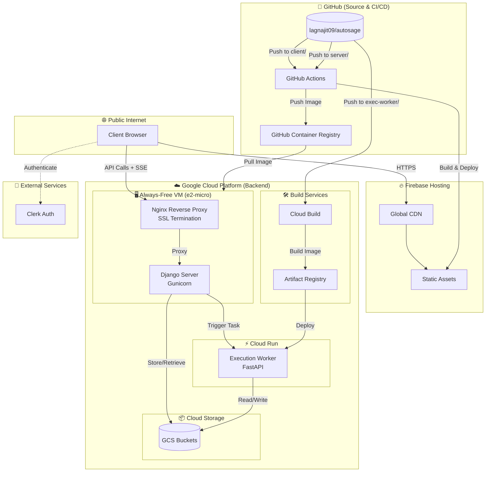

# Autosage Full-Stack Architecture

This document provides a high-level overview of the entire Autosage ecosystem, illustrating how the React frontend, Django backend, and FastAPI execution worker integrate to deliver a seamless developer experience — all while running on a $0/month cost structure.

---

## High-Level Architecture Diagram

The diagram below shows the interaction between the user, the cloud hosting providers, and the automated CI/CD pipelines.

---

## System Components

### 1. **Client (React + Vite)**

- **Role**: The user interface where developers build and manage workflows.
- **Hosting**: Served via **Firebase Hosting** for global edge performance and automatic SSL.
- **Auth**: Uses **Clerk** for secure, passwordless authentication.
- **Detailed Docs**: [client.architecture.md](./client.architecture.md)

### 2. **Server (Django + Gunicorn)**

- **Role**: The "Brain" of the system. Manages state, handles API requests, coordinates workflow execution, and provides real-time updates via SSE (Server-Sent Events).
- **Hosting**: Runs in a Docker container on a **GCP e2-micro VM** (Always Free tier).
- **Proxy**: **Nginx** acts as an HTTPS terminator and handles SSE buffering optimizations.
- **Detailed Docs**: [server.architecture.md](./server.architecture.md)

### 3. **Execution Worker (FastAPI)**

- **Role**: Handles heavy-duty code execution and specialized tasks. It is decoupled from the main server to allow for independent scaling.
- **Hosting**: Deployed on **Serverless Cloud Run**, scaling to zero when not in use to maintain $0 cost.
- **Detailed Docs**: [worker.architecture.md](./worker.architecture.md)

---

## Cross-Component Communication

1. **Client → Server**: Standard REST API calls and persistent SSE connections for streaming logs/outputs.
2. **Server → Worker**: The Django server invokes the Cloud Run worker using IAM-authenticated HTTP requests.
3. **Component → Storage**: Both the Server and Worker interact with **Google Cloud Storage (GCS)** for persistent file storage, using Service Account keys for authorized access.

---

## Unified CI/CD Strategy

Autosage uses a multi-cloud CI/CD approach to optimize for speed and cost:

- **Frontend**: GitHub Actions builds the React app and deploys it to Firebase channels.
- **Backend (Server)**: GitHub Actions builds a Docker image, pushes it to GHCR, and signals the GCP VM to pull and restart.
- **Backend (Worker)**: Google Cloud Build triggers on repo changes, builds the image via Artifact Registry, and updates the Cloud Run revision.

---

## Security Summary

- **HTTPS Throughout**: All traffic is encrypted via SSL (Firebase-managed for frontend, Nginx/Self-signed for backend).
- **Secrets Management**: Sensitive keys are stored in GitHub Repository Secrets (for CI/CD) and GCP Secret Manager (for runtime).
- **Least Privilege**: Components use dedicated Google Service Accounts with minimal required permissions.

---

## The "$0" Philosophy

The entire architecture is designed to stay within the **GCP Always-Free tier** and **Firebase Spark plan**. By utilizing e2-micro instances, Cloud Run's free quota, and edge hosting, the system scales reliably at zero operational cost for individual developers.
