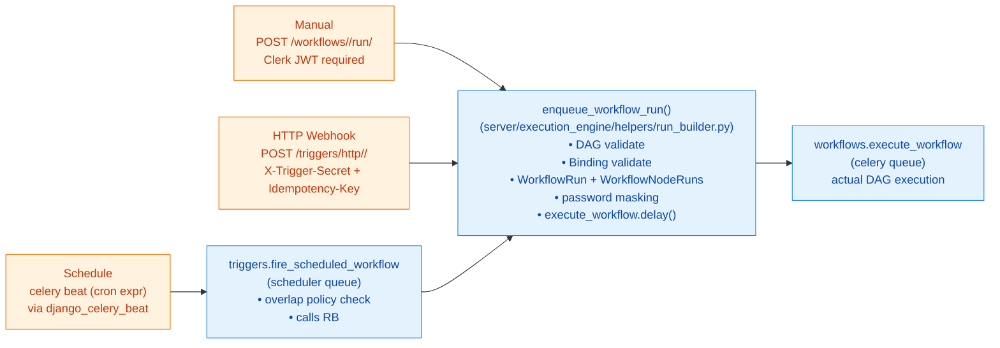

# Autosage Full-Stack Architecture — v2

> **What changed since v1**: The Django control plane was moved from a GCP
> e2-micro VM to an **OCI Ampere A1** VM running a multi-container
> `docker compose` stack (django + celery + beat + scheduler-worker + nginx
>
> - certbot). HTTPS is now real Let's Encrypt against a DuckDNS subdomain
>   instead of the GCP self-signed cert. The exec-worker (FastAPI) is
>   unchanged — still on Cloud Run.
>
> v1 docs are archived in [./v1/](./v1/).

This document gives the system-wide view: who talks to whom, over what
protocol, with what credentials. For component-level deployment details see
[client.architecture.md](./client.architecture.md),
[server.architecture.md](./server.architecture.md), and
[worker.architecture.md](./worker.architecture.md).

---

## System diagram

```mermaid
flowchart TD
    classDef user fill:#f6f8fa,stroke:#d1d5da,color:#000
    classDef github fill:#24292e,stroke:#24292e,color:#fff
    classDef firebase fill:#ffca28,stroke:#f57c00,color:#000
    classDef oci fill:#f80000,stroke:#a00,color:#fff
    classDef gcp fill:#4285f4,stroke:#1565c0,color:#fff
    classDef supabase fill:#3ecf8e,stroke:#066b3d,color:#fff
    classDef upstash fill:#00e9a3,stroke:#019f6f,color:#000
    classDef clerk fill:#6c47ff,stroke:#5531e2,color:#fff
    classDef duckdns fill:#fffe88,stroke:#a59f00,color:#000
    classDef server fill:#e3f2fd,stroke:#1e88e5,color:#0d47a1
    classDef worker fill:#e8f5e9,stroke:#43a047,color:#1b5e20
    classDef proxy fill:#fce4ec,stroke:#c2185b,color:#880e4f
    classDef bg-django fill:#bbdefb,stroke:#1976d2,color:#0d47a1

    %% ── External actors ──────────────────────────────────────────────
    subgraph Internet ["Public internet"]
        Browser["End user's browser<br/>(React app, Clerk SDK,<br/>EventSource for SSE)"]:::user
    end

    subgraph DNS ["DuckDNS (free DDNS)"]
        DDNS["autosagex-api.duckdns.org<br/>A record → A1 public IP<br/>(used for Let's Encrypt HTTP-01)"]:::duckdns
    end

    %% ── Identity ─────────────────────────────────────────────────────
    subgraph Identity ["Clerk (auth)"]
        Clerk["Clerk Cloud<br/>JWT issuer + JWKS<br/>Frontend SDK + Backend verify"]:::clerk
    end

    %% ── Source / CI ──────────────────────────────────────────────────
    subgraph GitHub ["GitHub"]
        Repo[("Repo: lagnajit09/autosage")]:::github
        GHA_C["Actions: firebase-hosting.yml<br/>trigger: client/**"]:::github
        GHA_S["Actions: deploy-server.yml<br/>trigger: server/**, nginx/**,<br/>docker-compose.oci.yml"]:::github
        GHCR[("GHCR<br/>autosage-server:latest<br/>(linux/arm64)")]:::github
    end

    %% ── Frontend hosting ─────────────────────────────────────────────
    subgraph Firebase ["Firebase Hosting"]
        FBCDN["Global CDN<br/>HTTPS auto-managed<br/>VITE_API_URL → DuckDNS"]:::firebase
    end

    %% ── OCI control plane ────────────────────────────────────────────
    subgraph OCI ["Oracle Cloud (OCI Always-Free)"]
        subgraph A1 ["Ampere A1 VM<br/>Ubuntu 22.04 aarch64<br/>4 OCPU / 24 GB quota"]
            subgraph ComposeStack ["docker compose stack (autosage-net bridge)"]
                Nginx["nginx :80,:443<br/>HTTPS terminator<br/>SSE-safe proxy<br/>resolver 127.0.0.11"]:::proxy
                Django["django (Uvicorn ASGI :8000)<br/>NOT host-mapped<br/>Clerk JWT verify<br/>SSE relay from Redis Pub/Sub"]:::bg-django
                Celery["celery worker<br/>queue: celery<br/>execute_workflow task"]:::server
                Beat["celery beat<br/>django_celery_beat<br/>DatabaseScheduler"]:::server
                Sched["celery worker<br/>queue: scheduler<br/>fire_scheduled_workflow"]:::server
                Certbot["certbot one-shot<br/>(profile: tools)<br/>webroot challenge<br/>renewal via cron"]:::server
                Vols[("named volumes:<br/>letsencrypt, certbot-webroot")]:::server
            end
        end
    end

    %% ── Execution plane (Cloud Run) ──────────────────────────────────
    subgraph GCP ["Google Cloud Platform"]
        subgraph CloudRun ["Cloud Run (autoscale 0→2)"]
            Worker["exec-worker (FastAPI)<br/>SSH/WinRM script exec<br/>SMTP email exec<br/>NDJSON stream back"]:::worker
        end
        subgraph BuildSvc ["Cloud Build + Artifact Registry"]
            CB["Cloud Build<br/>trigger: exec-worker/**"]:::gcp
            AR[("Artifact Registry<br/>execution-worker:SHA")]:::gcp
        end
        subgraph GCSStorage ["Cloud Storage"]
            GCS_D[("autosagex-drive<br/>script bodies")]:::gcp
            GCS_L[("autosagex-logs<br/>stdout/stderr/logs.json<br/>per execution")]:::gcp
        end
        SM["Secret Manager<br/>WORKER_API_KEY, ENVIRONMENT"]:::gcp
    end

    %% ── External data plane ──────────────────────────────────────────
    Supabase[("Supabase Postgres<br/>workflows, runs, node_runs,<br/>vault (Fernet-encrypted),<br/>django_celery_beat tables")]:::supabase
    Redis[("Upstash Redis<br/>Celery broker + result backend<br/>Pub/Sub: workflow_run:{id}:logs")]:::upstash

    %% ── Flows: user → frontend ──────────────────────────────────────
    Browser -->|"1\. GET /<br/>HTTPS"| FBCDN
    Browser -.->|"2\. JWT sign-in"| Clerk
    Browser -->|"3\. fetch + EventSource<br/>https://<duckdns>/api/..."| DDNS
    DDNS -->|"A → public IP"| Nginx
    Browser -->|"4\. API + SSE<br/>Authorization: Bearer JWT"| Nginx

    %% ── Flows: nginx → django ───────────────────────────────────────
    Nginx -->|"http://django:8000<br/>X-Forwarded-Proto: https<br/>proxy_buffering off"| Django
    Django -.->|"verify JWT via JWKS<br/>(1h LocMem cache)"| Clerk

    %% ── Flows: django data plane ────────────────────────────────────
    Django <-->|"5\. ORM<br/>conn_max_age 600s"| Supabase
    Django <-->|"6\. Celery enqueue<br/>+ Pub/Sub publish"| Redis
    Django <-->|"7\. download scripts<br/>upload logs"| GCS_D
    Django -->|"8\. POST /api/worker/execute<br/>OIDC bearer token<br/>NDJSON streaming"| Worker

    %% ── Flows: workers ──────────────────────────────────────────────
    Celery <-->|"consume<br/>celery queue"| Redis
    Sched  <-->|"consume<br/>scheduler queue"| Redis
    Beat   -->|"enqueue<br/>fire_scheduled_workflow"| Redis
    Beat   -->|"read PeriodicTask"| Supabase
    Celery -->|"streaming POST<br/>same path as Django"| Worker

    %% ── Flows: exec-worker ──────────────────────────────────────────
    Worker -->|"fetch script (fallback)"| GCS_D
    Worker -->|"SSH/WinRM"| RemoteVM[("Target VMs<br/>Linux/Windows")]:::user
    Worker -->|"SMTP TLS"| Gmail[("Gmail SMTP<br/>(if email node)")]:::user

    %% ── Flows: logs ─────────────────────────────────────────────────
    Worker -.->|"NDJSON stream"| Django
    Django -->|"publish per chunk"| Redis
    Redis  -->|"subscribe + SSE"| Nginx
    Django -->|"upload final bundle"| GCS_L

    %% ── Flows: CI/CD ────────────────────────────────────────────────
    Repo -->|"push client/**"| GHA_C
    Repo -->|"push server/**, nginx/**"| GHA_S
    Repo -->|"push exec-worker/**"| CB

    GHA_C -->|"deploy"| FBCDN
    GHA_S -->|"build & push linux/arm64"| GHCR
    GHA_S -->|"ssh + scp + docker compose"| A1
    GHCR  -->|"docker compose pull"| A1

    CB -->|"build & push"| AR
    AR -->|"gcloud run deploy"| Worker
    SM -.->|"injected as env"| Worker

    %% ── Cert renewal ────────────────────────────────────────────────
    Certbot <-->|"ACME http-01<br/>/.well-known/acme-challenge"| Nginx
    Certbot -->|"writes cert"| Vols
    Nginx -->|"reads cert"| Vols
```

---

## Component summary

| Component                             | Where it runs               | What it does                                                                                   | v1 → v2 delta                                                                                  |
| ------------------------------------- | --------------------------- | ---------------------------------------------------------------------------------------------- | ---------------------------------------------------------------------------------------------- |
| **React client**                      | Firebase Hosting            | UI, Clerk sign-in, EventSource for SSE                                                         | `VITE_API_URL` points at DuckDNS instead of GCP IP                                             |
| **nginx**                             | OCI A1, in `docker compose` | TLS terminator (real Let's Encrypt), HTTP→HTTPS redirect, SSE-safe proxy, ACME http-01 webroot | New — was on GCP VM directly with a self-signed cert                                           |
| **Django (Uvicorn ASGI)**             | OCI A1, in `docker compose` | Control plane: REST API, SSE relay, Clerk JWT verify, Celery dispatcher                        | Moved from GCP e2-micro (Gunicorn) to OCI A1 (Uvicorn). New `SECURE_PROXY_SSL_HEADER` setting. |
| **Celery worker (`celery` queue)**    | OCI A1                      | `execute_workflow` task — DAG traversal, exec-worker dispatch, log streaming                   | Now a separate container in compose (was in-process or unscaled on GCP)                        |
| **Celery Beat**                       | OCI A1                      | Cron dispatcher using `django_celery_beat.DatabaseScheduler`                                   | Now a separate container                                                                       |
| **Celery worker (`scheduler` queue)** | OCI A1                      | `fire_scheduled_workflow` — never blocked by long workflow runs                                | Now a separate container                                                                       |
| **certbot one-shot**                  | OCI A1 (profile `tools`)    | Initial cert issuance + 90-day auto-renewal via cron                                           | New                                                                                            |
| **exec-worker (FastAPI)**             | Cloud Run (autoscale 0→2)   | SSH/WinRM/SMTP execution, NDJSON streaming                                                     | Unchanged                                                                                      |
| **Supabase Postgres**                 | Supabase Cloud              | Workflows, runs, node_runs, Vault (Fernet-encrypted), Celery Beat tables                       | Unchanged                                                                                      |
| **Upstash Redis**                     | Upstash Cloud               | Celery broker + result + Pub/Sub log relay                                                     | Unchanged                                                                                      |
| **GCS `autosagex-drive`**             | Google Cloud Storage        | Script bodies (`scripts/{user}/{id}/...`)                                                      | Unchanged                                                                                      |
| **GCS `autosagex-logs`**              | Google Cloud Storage        | Per-execution stdout/stderr/`logs.json`                                                        | Unchanged                                                                                      |
| **Clerk**                             | Clerk Cloud                 | OAuth-style JWT issuance                                                                       | Unchanged                                                                                      |
| **DuckDNS**                           | DuckDNS service             | Free dynamic DNS for the A1 public IP — enables real LE cert                                   | New                                                                                            |

---

## Numbered request flow (end-to-end workflow run)

The numbers on the arrows in the diagram trace this flow:

1. **Frontend load.** Browser fetches the SPA from Firebase CDN.
2. **Auth.** Clerk SDK signs the user in and exchanges credentials for a JWT.
3. **Hostname resolution.** Browser resolves `autosagex-api.duckdns.org` → the A1 public IP via DuckDNS.
4. **API request.** Browser POSTs to `https://<duckdns>/api/execution-engine/workflows/<id>/run/` with the Clerk JWT in the `Authorization: Bearer` header. nginx terminates TLS, sets `X-Forwarded-Proto: https`, and proxies to `http://django:8000` on the internal bridge. Django's `SECURE_PROXY_SSL_HEADER` setting lets it know the original scheme was HTTPS — so any generated absolute URLs (trigger URLs, polling URLs) come out with the right scheme.
5. **Persist.** Django creates the `WorkflowRun` + `WorkflowNodeRun` rows in Supabase.
6. **Enqueue + subscribe.** Django publishes the task on the `celery` Redis queue, returns 202 with the run id. The client opens an `EventSource` to `/api/execution-engine/workflows/runs/<id>/stream/`, which subscribes Django's async view to the per-run Redis Pub/Sub channel.
7. **Script fetch + render.** The Celery worker pops the task, fetches each action node's script body from GCS `autosagex-drive`, and renders `{{param}}` placeholders.
8. **Execute.** Celery POSTs an NDJSON-streaming request to the Cloud Run exec-worker (`X-API-Key` header + a Google OIDC identity token for `--no-allow-unauthenticated`). The worker SSHes/WinRMs into the target VM, runs the script, and streams stdout/stderr line-by-line back to Django.
9. **Stream relay.** For each NDJSON chunk Django publishes a Pub/Sub event on `workflow_run:<id>:logs`. The SSE async view picks it up and pushes an event to the browser. nginx is configured with `proxy_buffering off` and a long `proxy_read_timeout` so the chunks arrive in real time, not at the end.
10. **Persist final logs.** When the workflow finishes, Celery uploads stdout/stderr/`logs.json` to GCS `autosagex-logs` and updates the WorkflowRun status.
11. **(Optional) Email.** If `send_email=True` was set when the run was triggered, Django dispatches a final completion email via Gmail SMTP using the template at `server/execution_engine/templates/email/`.

---

## Trigger sources (all converge on the same Celery task)

```mermaid
flowchart LR
    classDef trigger fill:#fff3e0,stroke:#ef6c00,color:#bf360c
    classDef internal fill:#e3f2fd,stroke:#1e88e5,color:#0d47a1

    Manual["Manual<br/>POST /workflows/<id>/run/<br/>Clerk JWT required"]:::trigger
    HTTP["HTTP Webhook<br/>POST /triggers/http/<token>/<br/>X-Trigger-Secret + Idempotency-Key"]:::trigger
    Cron["Schedule<br/>celery beat (cron expr)<br/>via django_celery_beat"]:::trigger

    Manual --> RB["enqueue_workflow_run()<br/>(server/execution_engine/helpers/run_builder.py)<br/>• DAG validate<br/>• Binding validate<br/>• WorkflowRun + WorkflowNodeRuns<br/>• password masking<br/>• execute_workflow.delay()"]:::internal
    HTTP --> RB
    Cron --> Fire["triggers.fire_scheduled_workflow<br/>(scheduler queue)<br/>• overlap policy check<br/>• calls RB"]:::internal
    Fire --> RB
    RB --> Exec["workflows.execute_workflow<br/>(celery queue)<br/>actual DAG execution"]:::internal
```

The key point: **all three trigger paths funnel through `enqueue_workflow_run()`** — single source of truth for validation, persistence, and dispatch. Scheduled triggers also go through a lightweight dispatcher (`fire_scheduled_workflow`) on a dedicated `scheduler` queue so cron firing is never blocked behind hour-long workflow runs.

---

## Security boundaries

| Boundary                           | Mechanism                                                                                                                                            |
| ---------------------------------- | ---------------------------------------------------------------------------------------------------------------------------------------------------- |
| Internet → nginx                   | TCP 80, 443 only. OCI VCN Security List + host iptables both must allow.                                                                             |
| nginx → Django                     | Internal docker bridge. Django uses `expose: ["8000"]` only — never host-mapped.                                                                     |
| Browser → Django (auth)            | Clerk JWT in `Authorization: Bearer`, verified against JWKS (1h LocMem cache) by `ClerkAuthMiddleware`. DRF default permission is `IsAuthenticated`. |
| Public webhook → Django (no Clerk) | `trigger_token` (URL slug) + bcrypt-verified `X-Trigger-Secret` header + required `Idempotency-Key`. Per-token rate limit.                           |
| Django → Cloud Run worker          | `X-API-Key` header + (in PROD) Google OIDC ID token whose `aud` matches `EXEC_WORKER_AUDIENCE`. Cloud Run service is `--no-allow-unauthenticated`.   |
| Django/worker → GCS                | Service-account JSON key (mounted as `/app/creds/service-account.json:ro`), or ADC in PROD on Cloud Run.                                             |
| Django ↔ Supabase                  | Standard TLS Postgres conn string, `conn_max_age=600`, `conn_health_checks=True`.                                                                    |
| Django ↔ Redis                     | Upstash `rediss://` (TLS), `socket_timeout=30`, keepalive, retry on timeout.                                                                         |
| Vault secrets at rest              | Fernet (`cryptography`) with key derived from `VAULT_ENCRYPTION_KEY` via SHA-256. Per-field encryption on `Credential` model.                        |
| HTTP-trigger secret at rest        | bcrypt hash. Plaintext shown to user exactly once on create/rotate.                                                                                  |

---
