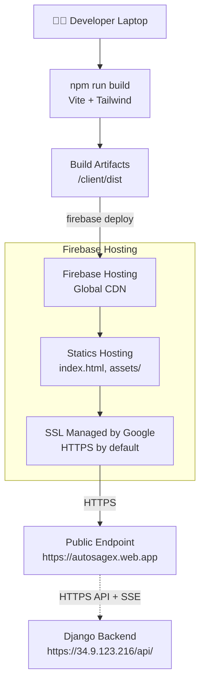
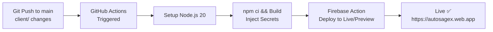

# Autosage React Client — Deployment Guide

**Project**: autosagex01 (us-central1)  
**Repo**: lagnajit09/autosage  
**Trigger path**: `client/**`

## Complete Deployment Flow

**From local Vite code → Production Firebase Hosting endpoint. $0/month.**

---

## Architecture Overview



---

## CI/CD Flow (GitHub Actions)



---

## Phase-by-Phase Deployment

### Phase 1 — Local Preparation

1. **Environment Config**: The React app uses Vite which reads from `.env` files. `VITE_CLERK_PUBLISHABLE_KEY` and `VITE_API_URL` are required.
2. **Build Test**: Run `npm run build` in the `client/` directory to ensure the production bundle is generated in `dist/` without errors.
3. **Firebase CLI**: Install `firebase-tools` locally and run `firebase login`.

### Phase 2 — Firebase Project Setup

1. **Create Project**: Initialize the `autosagex` project in the Firebase Console.
2. **Enable Hosting**: Select "Hosting" from the console build menu.
3. **Configure Settings**: The `firebase.json` is set to serve the `dist` folder and rewrite all requests to `index.html` (for SPA routing).

### Phase 3 — GitHub Secrets Configuration

To enable automated deployments, the following secrets must be added to the GitHub repository (**Settings > Secrets and variables > Actions**):

- `FIREBASE_SERVICE_ACCOUNT`: The JSON service account key for deployment permissions.
- `VITE_CLERK_PUBLISHABLE_KEY`: Clerk authentication key for the production environment.
- `VITE_API_URL`: The HTTPS URL of the Django backend (e.g., `https://34.9.123.216`).

### Phase 4 — CI/CD Workflow Setup

The workflow file `.github/workflows/firebase-hosting.yml` manages the pipeline:

1. **Trigger**: Push to `main` or Pull Requests impacting the `client/` folder.
2. **Env Injection**: The build step explicitly creates a `.env.production` file using the GitHub secrets before running `vite build`.
3. **Hosting Channel**: Merges to `main` deploy to the `live` channel; Pull Requests deploy to temporary `preview` channels for testing.

---

## Environment Variables

| Variable                     | Source    | Purpose                                 |
| :--------------------------- | :-------- | :-------------------------------------- |
| `VITE_API_URL`               | GH Secret | Base URL for backend API calls          |
| `VITE_CLERK_PUBLISHABLE_KEY` | GH Secret | Clerk Frontend API key                  |
| `FIREBASE_SERVICE_ACCOUNT`   | GH Secret | Permissions for Firebase CLI            |
| `GITHUB_TOKEN`               | Built-in  | Used by Firebase Action for PR comments |

---

## Final Verification Checklist

```
☐ Build: npm run build passes locally
☐ Firebase: firebase.json points to 'dist'
☐ Secrets: VITE_API_URL and CLERK keys set in GitHub
☐ Secrets: Firebase Service Account JSON added to GitHub
☐ CI/CD: Trigger fires on push to client/**
☐ Preview: PRs generate unique preview URLs
☐ Live: https://autosagex.web.app reflects main branch
```

---

## Monthly Cost: $0

| Resource                   | Free Limit   | Used     | Cost   |
| :------------------------- | :----------- | :------- | :----- |
| Firebase Hosting (Storage) | 10 GB        | < 100 MB | $0     |
| Data Transfer              | 360 MB / day | Low      | $0     |
| SSL / Custom Domain        | Included     | Managed  | $0     |
| GitHub Actions             | 2,000 min/mo | ~50 min  | $0     |
| **Total**                  |              |          | **$0** |
