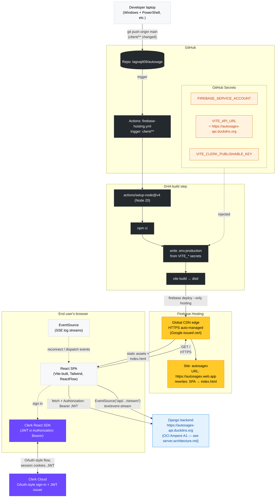
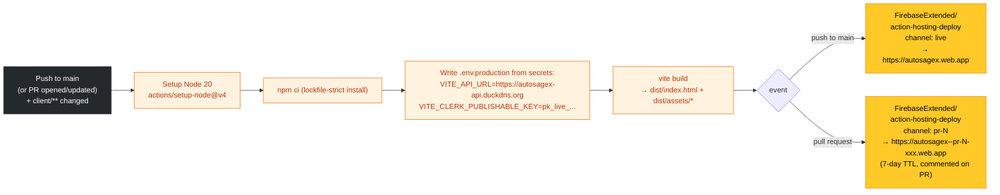

# Autosage React Client — Deployment Architecture v2

**Hosting**: Firebase Hosting · **Build**: Vite + Tailwind + Radix UI · **Repo path**: `client/**`

> **What changed since v1**: The backend `VITE_API_URL` was repointed from
> the GCP e2-micro IP (`https://34.9.123.216`) to the OCI A1 DuckDNS
> hostname (`https://autosagex-api.duckdns.org`). The Firebase pipeline
> itself is unchanged. v1 doc archived at
> [./v1/client.architecture.md](./v1/client.architecture.md).

---

## Architecture overview

```mermaid
flowchart TD
    classDef dev fill:#f6f8fa,stroke:#d1d5da,color:#000
    classDef github fill:#24292e,stroke:#24292e,color:#fff
    classDef firebase fill:#ffca28,stroke:#f57c00,color:#000
    classDef clerk fill:#6c47ff,stroke:#5531e2,color:#fff
    classDef oci fill:#e3f2fd,stroke:#1e88e5,color:#0d47a1
    classDef secret fill:#fff3e0,stroke:#ef6c00,color:#bf360c

    Dev[" Developer laptop<br/>(Windows + PowerShell, etc.)"]:::dev

    subgraph GH ["GitHub"]
        Repo[("Repo: lagnajit09/autosage")]:::github
        GHA["Actions: firebase-hosting.yml<br/>trigger: client/**"]:::github
        subgraph Secrets [" GitHub Secrets"]
            S_FB["FIREBASE_SERVICE_ACCOUNT"]:::secret
            S_API["VITE_API_URL<br/>= https://autosagex-api.duckdns.org"]:::secret
            S_CLERK["VITE_CLERK_PUBLISHABLE_KEY"]:::secret
        end
    end

    subgraph Build ["GHA build step"]
        BNode["actions/setup-node@v4 (Node 20)"]:::github
        BInstall["npm ci"]:::github
        BEnv["write .env.production<br/>from VITE_* secrets"]:::github
        BBuild["vite build → dist/"]:::github
        BNode --> BInstall --> BEnv --> BBuild
    end

    subgraph FB ["Firebase Hosting"]
        FBCDN["Global CDN edge<br/>HTTPS auto-managed<br/>(Google-issued cert)"]:::firebase
        FBSite["Site: autosagex<br/>URL: https://autosagex.web.app<br/>rewrites: SPA → index.html"]:::firebase
        FBCDN --> FBSite
    end

    subgraph Browser ["End user's browser"]
        SPA["React SPA<br/>(Vite-built, Tailwind, ReactFlow)"]:::dev
        ClerkSDK["Clerk React SDK<br/>(JWT in Authorization: Bearer)"]:::clerk
        ES["EventSource<br/>(SSE log streams)"]:::dev
    end

    Clerk[" Clerk Cloud<br/>OAuth-style sign-in + JWT issuer"]:::clerk
    Backend[" Django backend<br/>https://autosagex-api.duckdns.org<br/>(OCI Ampere A1 — see server.architecture.md)"]:::oci

    %% Flows
    Dev -->|"git push origin main<br/>(client/** changed)"| Repo
    Repo -->|"trigger"| GHA
    Secrets -.->|"injected"| BEnv
    GHA --> BNode
    BBuild -->|"firebase deploy --only hosting"| FBCDN

    SPA -->|"GET /<br/>HTTPS"| FBCDN
    FBCDN -->|"static assets +<br/>index.html"| SPA
    SPA -.->|"sign in"| ClerkSDK
    ClerkSDK <-->|"OAuth-style flow,<br/>session cookies, JWT"| Clerk
    SPA -->|"fetch + Authorization: Bearer JWT"| Backend
    SPA -->|"EventSource('/api/.../stream/')<br/>text/event-stream"| Backend
    ES -.->|"reconnect / dispatch events"| SPA
```

---

## CI/CD flow (GitHub Actions → Firebase)

```mermaid
flowchart LR
    classDef gh fill:#24292e,stroke:#24292e,color:#fff
    classDef step fill:#fff3e0,stroke:#ef6c00,color:#bf360c
    classDef fb fill:#ffca28,stroke:#f57c00,color:#000

    A["Push to main<br/>(or PR opened/updated)<br/>+ client/** changed"]:::gh
    A --> B["Setup Node 20<br/>actions/setup-node@v4"]:::step
    B --> C["npm ci (lockfile-strict install)"]:::step
    C --> D["Write .env.production from secrets:<br/>VITE_API_URL=https://autosagex-api.duckdns.org<br/>VITE_CLERK_PUBLISHABLE_KEY=pk_live_..."]:::step
    D --> E["vite build<br/>→ dist/index.html + dist/assets/*"]:::step
    E --> F{"event"}
    F -->|"push to main"| L["FirebaseExtended/<br/>action-hosting-deploy<br/>channel: live<br/>→ https://autosagex.web.app"]:::fb
    F -->|"pull request"| P["FirebaseExtended/<br/>action-hosting-deploy<br/>channel: pr-N<br/>→ https://autosagex--pr-N-xxx.web.app<br/>(7-day TTL, commented on PR)"]:::fb
```

The same workflow handles both production deploys (on push to `main`) and ephemeral preview channels (on pull requests).

---

## Backend API contract — what the client expects

| Concern           | Convention                                                                                                                                                                                                                                                                                        |
| ----------------- | ------------------------------------------------------------------------------------------------------------------------------------------------------------------------------------------------------------------------------------------------------------------------------------------------- |
| Auth              | `Authorization: Bearer <clerk JWT>` on every request except the public health and HTTP-trigger endpoints.                                                                                                                                                                                         |
| Base URL          | `import.meta.env.VITE_API_URL` (see [src/lib/api-client.ts](../client/src/lib/api-client.ts)). Falls back to `http://localhost:8000` in dev.                                                                                                                                                      |
| Response envelope | All responses match `{success, status, status_code, message, data, errors}` per [server/server/exceptions.py](../server/server/exceptions.py) + `api_response()` helper.                                                                                                                          |
| Real-time logs    | `new EventSource(<api>/api/execution-engine/workflows/runs/<id>/stream/)`. Events: `status`, `node_start`, `node_complete`, `log`, `stdout`, `stderr`, `exit_code`, `done`.                                                                                                                       |
| Trigger URLs      | Webhook URLs come back from Django pre-built (e.g. `https://autosagex-api.duckdns.org/api/execution-engine/triggers/http/<token>/`). Requires `SECURE_PROXY_SSL_HEADER` on the backend so they come out as `https://` and not `http://` — see [server.architecture.md](./server.architecture.md). |

The frontend doesn't need to know about the OCI/nginx/Celery details — from its perspective, the API is just an HTTPS host at the DuckDNS name.

---

## Required GitHub Secrets

| Secret name                  | Purpose                                                            | Example value                                                   |
| ---------------------------- | ------------------------------------------------------------------ | --------------------------------------------------------------- |
| `FIREBASE_SERVICE_ACCOUNT`   | Firebase deploy SA JSON                                            | `{ "type": "service_account", "project_id": "autosagex", ... }` |
| `VITE_API_URL`               | Backend base URL the client fetches                                | `https://autosagex-api.duckdns.org`                             |
| `VITE_CLERK_PUBLISHABLE_KEY` | Clerk Frontend API key (publishable)                               | `pk_live_...`                                                   |
| `GITHUB_TOKEN`               | Auto-provided to Action; used by Firebase action to comment on PRs | (built-in)                                                      |

---

## Migration impact (v1 → v2)

Only one effective change: update `VITE_API_URL` in the GitHub Secrets UI from the old GCP host to the new DuckDNS host, then re-run the Firebase workflow (push, manual trigger, or re-run the latest run). The rebuilt bundle embeds the new URL.

After the redeploy verify in DevTools:

- **Network tab**: every `/api/...` request goes to `https://autosagex-api.duckdns.org` with a green padlock.
- **Console**: no `Mixed Content` errors (would mean some hard-coded `http://` URL slipped through), no `CORS` errors (would mean the OCI Django's `CORS_ALLOWED_ORIGINS` doesn't include the Firebase origin yet).
- **EventStream sub-tab on `/stream/` requests**: events arrive in real time (proves nginx isn't buffering).

---
