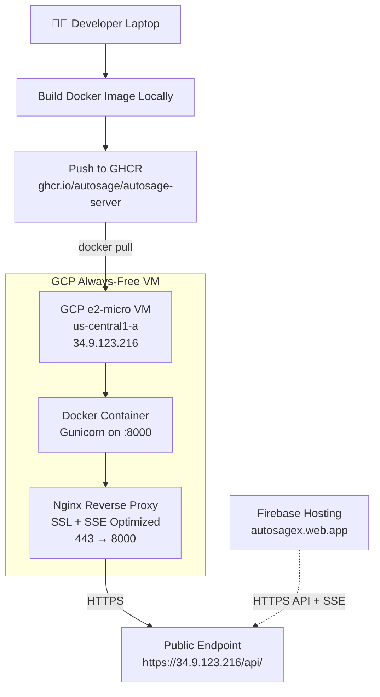
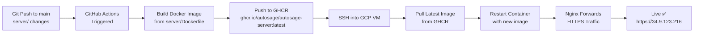
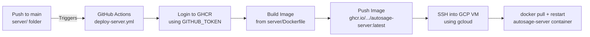

# Autosage Django Server — Deployment Guide

**Project**: autosagex01 (us-central1)  
**Repo**: lagnajit09/autosage  
**Trigger path**: `server/**`

## Complete Deployment Flow

**From local Django code → Production HTTPS endpoint on GCP Always-Free VM. $0/month.**

---

## Architecture Overview



---

## Full CI/CD Flow



---

## Phase-by-Phase Deployment

### Phase 1 — Local Preparation

**Goal**: Make the Django project container-ready and production-aware.

1. **Add a health check endpoint**
   A lightweight URL (`/api/health/`) is added to Django's URL config that simply returns an `OK` response with HTTP 200. This is used later to confirm the server is running correctly after deployment — without needing to test business logic.

2. **Environment-aware settings**
   `settings.py` is updated to read sensitive values from environment variables instead of hardcoding them. This includes `DEBUG`, `ALLOWED_HOSTS`, `CORS_ALLOW_ALL_ORIGINS`, and database/GCS credentials. This allows the same codebase to behave differently in development vs. production.

3. **Write a Dockerfile**
   A Dockerfile is created inside the `server/` folder. It defines the Python version, installs all dependencies from `requirements.txt`, copies the project code into the image, and sets Gunicorn as the process that starts Django on port `8000` when the container launches.

4. **Build the Docker image locally**
   The Dockerfile is used to build a Docker image on the developer's machine. The image is tagged with the GHCR naming convention so it can be pushed directly.

5. **Test locally**
   The image is run locally with a test `.env` file to confirm it boots successfully and the health endpoint returns `OK`.

---

### Phase 2 — Publish Image to GHCR

**Goal**: Store the Docker image in a registry accessible by the GCP VM.

6. **Create a GitHub Personal Access Token (PAT)**
   A PAT is generated from GitHub Settings with `read:packages` and `write:packages` scopes. This token acts as the password when authenticating Docker to GHCR.

7. **Authenticate Docker to GHCR**
   The PAT is piped into the `docker login` command via `--password-stdin` to securely log Docker into `ghcr.io` without exposing the token in shell history.

8. **Tag and push the image**
   The locally built image is tagged with the full GHCR path (`ghcr.io/USERNAME/REPO/autosage-server:latest`) and pushed to GitHub Container Registry.

9. **Make the package public**
   From the GitHub repo's **Packages** section → Package Settings, the image visibility is changed to **Public**. This allows the GCP VM to pull the image without needing authentication.

10. **Verify in GitHub**
    The image now appears under the repo's **Packages** tab with the correct tag and pull command visible.

---

### Phase 3 — Provision GCP VM

**Goal**: Create a free-forever virtual machine on GCP to host the server.

11. **Create the e2-micro VM**
    A VM named `autosage-vm` is created using `gcloud` with machine type `e2-micro` in zone `us-central1-a`. This region qualifies for GCP's Always Free tier — 1 e2-micro instance runs 24/7 at $0/month. The `http-server` network tag is added for firewall targeting later.

12. **Note the External IP**
    After creation, the external IP (e.g., `34.9.123.216`) is noted. This is the permanent public address for the backend.

13. **SSH into the VM**
    Using `gcloud compute ssh`, a secure shell session is opened directly into the VM without needing an SSH key file.

14. **Install Docker on the VM**
    Docker is installed from the Debian package repository. The system service is enabled to auto-start Docker on VM reboots. The current user is added to the `docker` group so Docker commands can run without `sudo`.

---

### Phase 4 — Transfer Secrets to VM

**Goal**: Securely place credentials on the VM that the container needs.

15. **Copy `.env` file to VM**
    The `.env` file from the local machine is securely copied to the VM's home directory using `gcloud compute scp` (GCP's built-in secure copy). This file contains environment variables like `DJANGO_DEBUG`, `ALLOWED_HOSTS`, and database URLs.

16. **Copy GCS service account key**
    The `gcs_key.json` (Google Cloud Service Account JSON key) is also transferred to the VM home directory via `gcloud compute scp`.

17. **Secure the files**
    Both files are given restricted permissions (`chmod 600`) on the VM so only the owner can read them.

---

### Phase 5 — Run Django Container on VM

**Goal**: Get the Django app running inside Docker on the VM.

18. **Pull the image**
    Docker pulls the latest `autosage-server` image from GHCR directly onto the VM.

19. **Run the container**
    The container is started in detached mode with:
    - **Port mapping** `8000:8000` — VM's port 8000 forwards to the container's Gunicorn process.
    - **`--env-file ~/.env`** — All environment variables are injected from the `.env` file.
    - **`-v ~/gcs_key.json:/app/creds/...`** — The GCS key file is mounted as a read-only volume inside the container at the path expected by the application.

20. **Verify container is healthy**
    A `curl` to `http://localhost:8000/api/health/` from the VM confirms Django is running and Gunicorn is serving requests correctly. Container logs are also checked for startup errors.

---

### Phase 6 — Configure Nginx + HTTPS

**Goal**: Expose the Django app on port 443 (HTTPS) with SSE support.

> **Why HTTPS?** The frontend (`autosagex.web.app`) is served over HTTPS via Firebase. Browsers block HTTP API calls from HTTPS pages as **Mixed Content**. Django runs on HTTP internally, so Nginx acts as the HTTPS terminator.

> **Why not Cloudflare Tunnel?** Cloudflare Tunnel buffers SSE (Server-Sent Events) streams, breaking real-time output streaming which Autosage relies on. Nginx with `proxy_buffering off` solves this.

21. **Install Nginx and OpenSSL**
    Both are installed from Debian's package manager on the VM.

22. **Generate a self-signed SSL certificate**
    A 365-day self-signed certificate is created for the VM's IP address using OpenSSL. This avoids the need for a domain name while still enabling HTTPS.

23. **Write the Nginx site config**
    A config file is created at `/etc/nginx/sites-available/autosage` with two server blocks:
    - **Port 80 block**: Redirects all HTTP traffic to HTTPS.
    - **Port 443 block**: Terminates SSL, then proxies requests to Django on `localhost:8000`. Key SSE settings are included: `proxy_buffering off`, `proxy_cache off`, and a 1-hour `proxy_read_timeout` to keep SSE connections alive.

24. **Enable the site**
    A symlink is created from `sites-available/autosage` → `sites-enabled/autosage` to activate the config.

25. **Test and restart Nginx**
    `nginx -t` validates the config syntax (critical — this is where the `$proxy_add_x_forwarded_for` typo was caught). Then Nginx is restarted and enabled to auto-start on VM reboots.

26. **Open firewall rules**
    A GCP firewall rule is created to allow inbound TCP traffic on ports **80** and **443** from all sources (`0.0.0.0/0`) targeting VMs with the `http-server` tag.

27. **Verify HTTPS health check**
    `curl -k https://34.9.123.216/api/health/` from the VM returns `OK`, confirming the full Nginx → Django chain works. The `-k` flag skips the self-signed cert warning.

---

### Phase 7 — Frontend Integration

**Goal**: Connect the Firebase frontend to the new HTTPS backend.

28. **Update React API URL**
    The frontend's environment config is updated to point to the HTTPS backend URL (`https://34.9.123.216`).

29. **Rebuild and redeploy Firebase**
    A fresh production build is created and deployed to Firebase Hosting. All API calls now go to `https://...` — no more Mixed Content errors.

30. **Browser verification**
    Opening `https://autosagex.web.app/workflows` in a browser and checking the Network tab confirms:
    - All API calls go to `https://34.9.123.216/api/...` ✅
    - SSE streams open and receive data in real-time ✅
    - Zero Mixed Content errors in console ✅

---

## IAM & Security

| Permission                             | Why Needed                 |
| -------------------------------------- | -------------------------- |
| `Compute Instance Admin`               | Create/manage VM           |
| `Service Account User`                 | Allow VM to use GCS        |
| `Artifact Registry Writer`             | Push images (if using GAR) |
| `Cloud Run Developer`                  | Deploy worker (next phase) |
| `roles/iam.serviceAccountTokenCreator` | GitHub Actions GCP auth    |

---

## CI/CD — GitHub Actions (Configured)



**Key CI/CD details:**

- Workflow file lives at `.github/workflows/deploy-server.yml`
- **Trigger**: Only fires when files inside `server/**` change — other folder changes are ignored
- **GHCR Auth**: Uses the built-in `GITHUB_TOKEN` secret — no PAT needed in CI
- **GCP Auth**: A GCP Service Account JSON key is stored as `GCP_SA_KEY` in GitHub Secrets
- **Zero downtime**: Old container is replaced with new one; Nginx keeps accepting traffic throughout

---

## Final Verification Checklist

```
☐ VM: e2-micro running in us-central1-a (Always Free region)
☐ Container: Django/Gunicorn healthy on port 8000
☐ Nginx: HTTPS proxy 443→8000 active (SSE-safe config)
☐ Firewall: Ports 80 + 443 open
☐ Health: https://34.9.123.216/api/health/ → "OK"
☐ Frontend: Zero mixed-content errors in browser console
☐ SSE: Real-time streams working on /workflows page
☐ Cost: $0/month on GCP free tier
```

---

## Monthly Cost: $0

| Resource                  | Free Limit | Used     | Cost   |
| ------------------------- | ---------- | -------- | ------ |
| e2-micro VM (us-central1) | 744 hrs/mo | ~744 hrs | $0     |
| Persistent Disk           | 30 GB      | ~10 GB   | $0     |
| Network Egress            | 200 GB/mo  | Low      | $0     |
| Nginx + SSL               | N/A        | N/A      | $0     |
| **Total**                 |            |          | **$0** |
