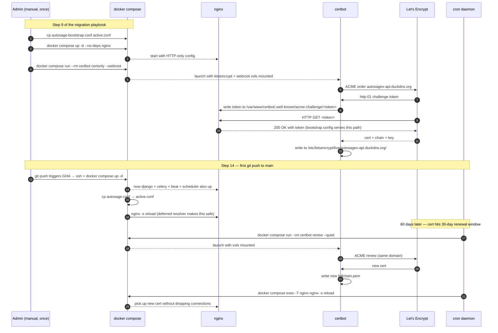
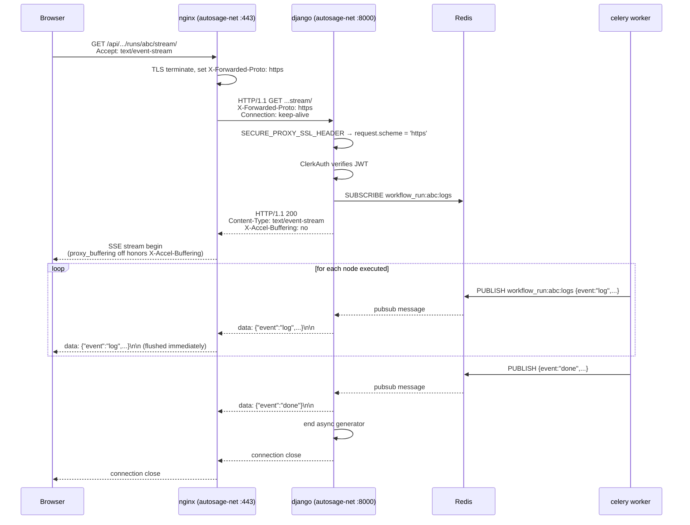

# Autosage Django Server — Deployment Architecture v2

**Host**: OCI Ampere A1 (Ubuntu 22.04 aarch64) · **Public name**: `autosagex-api.duckdns.org` · **Repo path**: `server/**` + `nginx/**` + `docker-compose.oci.yml`

> **What changed since v1**: Migrated from GCP e2-micro running a single
> Docker container behind a host-installed nginx with a self-signed cert,
> to OCI Ampere A1 running a five-service `docker compose` stack (django +
> celery + beat + scheduler-worker + nginx + on-demand certbot) behind a
> real Let's Encrypt cert. CI builds `linux/arm64` images, scp's compose +
> nginx configs to the host, and runs `docker compose pull && up -d`. v1
> doc archived at [./v1/server.architecture.md](./v1/server.architecture.md).
>
> Step-by-step migration playbook: [../plans/oci-config.md](../plans/oci-config.md).

---

## Architecture overview


```mermaid
flowchart TD
    classDef external fill:#f6f8fa,stroke:#d1d5da,color:#000
    classDef proxy fill:#fce4ec,stroke:#c2185b,color:#880e4f
    classDef django fill:#bbdefb,stroke:#1976d2,color:#0d47a1
    classDef worker fill:#c8e6c9,stroke:#388e3c,color:#1b5e20
    classDef volume fill:#fff9c4,stroke:#fbc02d,color:#5d4037
    classDef extdata fill:#e1bee7,stroke:#8e24aa,color:#4a148c

    %% External ingress
    Net["Internet<br/>:80, :443 only<br/>(OCI VCN + iptables)"]:::external
    DDNS["DuckDNS<br/>autosagex-api.duckdns.org<br/>A → A1 public IP"]:::external

    %% A1 host
    subgraph A1Host ["OCI Ampere A1 VM &nbsp;·&nbsp; Ubuntu 22.04 aarch64<br/>user: ubuntu &nbsp;·&nbsp; ~/autosage-server/"]
        subgraph Compose ["docker compose (autosage-net bridge)"]
            Nginx["<b>nginx :80 :443</b><br/>image: nginx:1.27-alpine<br/>publishes host ports 80, 443<br/>━━━━━━<br/>• HTTP → HTTPS 301<br/>• /.well-known/acme-challenge → /var/www/certbot<br/>• proxy_pass http://$django_upstream<br/>&nbsp;&nbsp;(deferred DNS via 127.0.0.11)<br/>• SSE-safe: proxy_buffering off,<br/>&nbsp;&nbsp;proxy_read_timeout 3600s,<br/>&nbsp;&nbsp;X-Accel-Buffering passthrough<br/>• X-Forwarded-Proto: $scheme"]:::proxy

            Django["<b>django (Uvicorn ASGI :8000)</b><br/>image: ghcr.io/lagnajit09/autosage/<br/>autosage-server:latest (arm64)<br/>expose only — NOT host-mapped<br/>━━━━━━<br/>• Django 5.2 + DRF<br/>• ClerkAuthMiddleware (JWKS 1h cache)<br/>• SECURE_PROXY_SSL_HEADER=X-Forwarded-Proto<br/>• Native async SSE views<br/>• healthcheck: GET /api/health/"]:::django

            Celery["<b>celery worker</b><br/>queue: celery · concurrency 4<br/>━━━━━━<br/>• workflows.execute_workflow<br/>• DAG traversal (networkx)<br/>• streams NDJSON from exec-worker<br/>• publishes to Redis Pub/Sub<br/>• uploads logs to GCS<br/>• 1800s soft / 3600s hard timeout"]:::worker

            Beat["<b>celery beat</b><br/>single instance · DatabaseScheduler<br/>━━━━━━<br/>• reads django_celery_beat tables<br/>• dispatches fire_scheduled_workflow<br/>&nbsp;&nbsp;(routed to scheduler queue)"]:::worker

            Sched["<b>celery worker</b> (dedicated)<br/>queue: scheduler · concurrency 2<br/>━━━━━━<br/>• triggers.fire_scheduled_workflow<br/>• enforces no-overlap policy<br/>• calls enqueue_workflow_run()"]:::worker

            Autobot["<b>autobot (Uvicorn :8030)</b><br/>image: ghcr.io/lagnajit09/autosage/<br/>autosage-autobot:latest (arm64)<br/>expose only — NOT host-mapped<br/>━━━━━━<br/>• FastAPI AI service<br/>• routed by nginx at /api/ai/*<br/>• Clerk JWT verify (JWKS 1h cache)<br/>• Redis DB /2: hot context + exec-quota<br/>• LiteLLM (admin pool + BYO)<br/>• v2: execution copilot tools<br/>  run_workflow/run_script/rerun_workflow<br/>  preview_workflow_run/investigation tools<br/>• Secure side-channel: /run/intent/ fulfill<br/>  (browser → Django, never through Autobot)"]:::django

            Certbot["<b>certbot</b> (profile: tools)<br/>image: certbot/certbot<br/>━━━━━━<br/>• one-shot, NOT started by 'up -d'<br/>• ACME http-01 via webroot<br/>• invoked by:<br/>&nbsp;&nbsp;– initial bootstrap (manual)<br/>&nbsp;&nbsp;– daily renewal cron 03:17 UTC"]:::worker

            LEVol[("named vol: letsencrypt<br/>/etc/letsencrypt<br/>cert + account state")]:::volume
            WRVol[("named vol: certbot-webroot<br/>/var/www/certbot<br/>ACME challenge files")]:::volume
        end

        subgraph BindMounts ["host bind mounts (read-only)"]
            ServerEnv[("server.env<br/>chmod 600<br/>$$ escaped")]:::external
            AutobotEnv[("autobot.env<br/>chmod 600<br/>AUTOBOT_EXEC_DAILY_LIMIT etc.")]:::external
            GcsKey[("gcs_key.json<br/>chmod 600<br/>→ /app/creds/service-account.json")]:::external
            NginxCfg[("nginx/active.conf<br/>→ /etc/nginx/conf.d/default.conf")]:::external
        end
    end

    %% External data plane
    Supabase[("Supabase Postgres<br/>· workflows<br/>· workflow_runs / node_runs<br/>· vault (Fernet-encrypted)<br/>· http_triggers, schedule_triggers<br/>· django_celery_beat_*")]:::extdata
    Redis[("Upstash Redis (rediss://)<br/>· Celery broker + result<br/>· Pub/Sub: workflow_run:{id}:logs<br/>· visibility_timeout 3600s")]:::extdata
    GCS_D[("GCS autosagex-drive<br/>script bodies<br/>scripts/{user}/{id}/...")]:::extdata
    GCS_L[("GCS autosagex-logs<br/>per-execution stdout/<br/>stderr/logs.json")]:::extdata
    ExecWorker["Cloud Run<br/>execution-worker<br/>(linux/amd64 — different host)"]:::worker
    Clerk["Clerk JWKS<br/>(JWT verification)"]:::external

    %% Flows in
    Net -->|"DNS lookup"| DDNS
    DDNS -->|"A record"| Net
    Net -->|"TCP 80 → 301 HTTPS<br/>TCP 443 → TLS"| Nginx
    Nginx -->|"http://django:8000<br/>(internal bridge)"| Django
    Nginx -->|"http://autobot:8030<br/>/api/ai/* (prefix stripped)"| Autobot

    %% Autobot side
    Autobot -.->|"JWKS fetch (cached 1h)"| Clerk
    Autobot <-->|"hot context + exec-quota<br/>(Redis DB /2)"| Redis
    Autobot -->|"forwarded Clerk JWT<br/>all Django API calls"| Django

    %% Django side
    Django -.->|"JWKS fetch (cached 1h)"| Clerk
    Django <-->|"ORM<br/>conn_max_age=600s"| Supabase
    Django <-->|"enqueue tasks +<br/>publish log chunks"| Redis
    Django -->|"download script bodies<br/>upload final log bundle"| GCS_D
    Django -->|"X-API-Key + OIDC token<br/>POST /api/worker/execute<br/>NDJSON streaming"| ExecWorker

    %% Worker container flows
    Celery <-->|"consume celery queue"| Redis
    Sched  <-->|"consume scheduler queue"| Redis
    Beat   -->|"enqueue periodic tasks"| Redis
    Beat   -->|"read PeriodicTask rows"| Supabase
    Celery -->|"same path as Django"| ExecWorker
    Celery -->|"final log bundle"| GCS_L

    %% Certbot flows
    Certbot <-->|"ACME http-01<br/>/.well-known/acme-challenge"| Nginx
    Certbot -->|"write fullchain.pem<br/>+ account keys"| LEVol
    Nginx -->|"read fullchain.pem +<br/>privkey.pem on reload"| LEVol
    Nginx -->|"serve challenge files"| WRVol
    Certbot -->|"write challenge files"| WRVol

    %% Bind mounts feeding containers
    ServerEnv -.->|"env_file"| Django
    ServerEnv -.->|"env_file"| Celery
    ServerEnv -.->|"env_file"| Beat
    ServerEnv -.->|"env_file"| Sched
    AutobotEnv -.->|"env_file"| Autobot
    GcsKey -.->|"ro volume"| Django
    GcsKey -.->|"ro volume"| Celery
    GcsKey -.->|"ro volume"| Beat
    GcsKey -.->|"ro volume"| Sched
    NginxCfg -.->|"ro volume"| Nginx
```

---

## CI/CD pipeline


```mermaid
flowchart LR
    classDef github fill:#24292e,stroke:#24292e,color:#fff
    classDef build fill:#fff3e0,stroke:#ef6c00,color:#bf360c
    classDef host fill:#fce4ec,stroke:#c2185b,color:#880e4f
    classDef registry fill:#0366d6,stroke:#0366d6,color:#fff

    A["git push origin main<br/>(server/**, nginx/**, docker-compose.oci.yml,<br/>or workflow file itself)"]:::github

    subgraph J1 ["Job: build-and-push (ubuntu-latest)"]
        B1["actions/checkout"]:::build
        B2["docker/setup-qemu-action<br/>platforms: arm64"]:::build
        B3["docker/setup-buildx-action"]:::build
        B4["docker/build-push-action<br/>context: ./server<br/>platforms: linux/arm64<br/>cache: type=gha"]:::build
        B1 --> B2 --> B3 --> B4
    end

    subgraph J2 ["Job: deploy (needs: build-and-push)"]
        D1["actions/checkout"]:::host
        D2["sed __DUCKDNS_DOMAIN__<br/>→ nginx/autosage.conf<br/>(from DUCKDNS_DOMAIN secret)"]:::host
        D3["appleboy/scp-action<br/>→ ~/autosage-server/<br/>(docker-compose.oci.yml,<br/>nginx/autosage.conf,<br/>nginx/autosage-bootstrap.conf)"]:::host
        D4["appleboy/ssh-action<br/>on the A1 VM:<br/>• docker login ghcr.io<br/>• seed active.conf if missing<br/>• docker compose pull<br/>• docker compose up -d --remove-orphans<br/>• if cert present:<br/>&nbsp;&nbsp;cp autosage.conf → active.conf<br/>&nbsp;&nbsp;nginx -t && nginx -s reload<br/>• docker image prune -f"]:::host
        D1 --> D2 --> D3 --> D4
    end

    subgraph J3 ["Job: health-check (needs: deploy)"]
        H1["ssh + docker exec django<br/>internal /api/health/ check"]:::host
        H2["curl https://autosagex-api.duckdns.org/api/health/<br/>(503 = soft pass during bootstrap)"]:::host
        H1 --> H2
    end

    GHCR[("GHCR<br/>autosage-server:latest<br/>(arm64 manifest)")]:::registry

    A --> B1
    B4 --> GHCR
    GHCR -.->|"docker compose pull"| D4
    B4 --> D1
    D4 --> H1
```

**Secrets consumed** (`Settings → Secrets and variables → Actions`):

| Secret           | Used by                | Purpose                                 |
| ---------------- | ---------------------- | --------------------------------------- |
| `GHCR_PAT`       | build-and-push, deploy | docker login to ghcr.io                 |
| `VM_HOST`        | deploy, health-check   | DuckDNS hostname or A1 public IP        |
| `VM_USER`        | deploy, health-check   | `ubuntu` (default OCI user)             |
| `VM_SSH_KEY`     | deploy, health-check   | private key, full PEM contents          |
| `VM_SSH_PORT`    | deploy, health-check   | `22`                                    |
| `DUCKDNS_DOMAIN` | deploy, health-check   | `autosagex-api.duckdns.org` (no scheme) |

---

## TLS bootstrap & renewal


```mermaid
sequenceDiagram
    autonumber
    participant Admin as Admin (manual, once)
    participant Compose as docker compose
    participant Nginx as nginx
    participant CB as certbot
    participant LE as Let's Encrypt
    participant Cron as cron daemon

    Note over Admin,Compose: Step 9 of the migration playbook
    Admin->>Compose: cp autosage-bootstrap.conf active.conf
    Admin->>Compose: docker compose up -d --no-deps nginx
    Compose-->>Nginx: start with HTTP-only config
    Admin->>Compose: docker compose run --rm certbot certonly --webroot
    Compose-->>CB: launch with letsencrypt + webroot vols mounted
    CB->>LE: ACME order autosagex-api.duckdns.org
    LE->>CB: http-01 challenge token
    CB->>Nginx: write token to /var/www/certbot/.well-known/acme-challenge/<token>
    LE->>Nginx: HTTP GET <token>
    Nginx-->>LE: 200 OK with token (bootstrap config serves this path)
    LE-->>CB: cert + chain + key
    CB->>CB: write to /etc/letsencrypt/live/autosagex-api.duckdns.org/

    Note over Admin,Cron: Step 14 — first git push to main
    Admin->>Compose: git push triggers GHA → ssh + docker compose up -d
    Compose-->>Nginx: now django + celery + beat + scheduler also up
    Compose->>Compose: cp autosage.conf → active.conf
    Compose->>Nginx: nginx -s reload (deferred resolver makes this safe)

    Note over Cron,LE: 60 days later — cert hits 30-day renewal window
    Cron->>Compose: docker compose run --rm certbot renew --quiet
    Compose-->>CB: launch with vols mounted
    CB->>LE: ACME renew (same domain)
    LE->>CB: new cert
    CB->>CB: write new fullchain.pem
    Cron->>Compose: docker compose exec -T nginx nginx -s reload
    Compose-->>Nginx: pick up new cert without dropping connections
```

The split between **`autosage-bootstrap.conf`** (HTTP-only, serves only the
ACME path) and **`autosage.conf`** (full TLS + reverse proxy) exists because
the production config references cert files that don't exist on a fresh host
_and_ references the `django` upstream by name. Neither can resolve cleanly
until after both certbot has issued the cert _and_ the django container is up
in the docker network. The two-phase swap with `active.conf` as the
indirection point resolves both issues in the right order.

After v2's deferred-DNS-resolution change (`resolver 127.0.0.11` + variable
`proxy_pass`), nginx will start successfully even when django is briefly
absent — making cert-renewal reloads bulletproof against transient django
restarts.

---

## Host directory layout

```
/home/ubuntu/autosage-server/
├── server.env                  # secrets, env_file for all 4 service containers (chmod 600)
├── gcs_key.json                # GCS SA key, mounted ro at /app/creds/service-account.json (chmod 600)
├── docker-compose.oci.yml      # scp'd by deploy workflow
├── certbot.log                 # cron renewal output (append-only)
└── nginx/
    ├── autosage.conf           # production TLS config (scp'd, __DUCKDNS_DOMAIN__ substituted)
    ├── autosage-bootstrap.conf # HTTP-only bootstrap (scp'd as-is)
    └── active.conf             # symlink-like copy of whichever conf is live
```

**Docker named volumes** (not on the host filesystem; managed by Docker):

| Volume            | Mounted by                                                | Purpose                                              |
| ----------------- | --------------------------------------------------------- | ---------------------------------------------------- |
| `letsencrypt`     | nginx (ro on cert read), certbot (rw on issuance/renewal) | `/etc/letsencrypt` — live certs + ACME account state |
| `certbot-webroot` | nginx (ro), certbot (rw)                                  | `/var/www/certbot` — http-01 challenge files         |

---

## Request flow through nginx (SSE example)


```mermaid
sequenceDiagram
    participant Browser
    participant Nginx as nginx (autosage-net :443)
    participant Django as django (autosage-net :8000)
    participant Redis
    participant Celery as celery worker

    Browser->>Nginx: GET /api/.../runs/abc/stream/<br/>Accept: text/event-stream
    Nginx->>Nginx: TLS terminate, set X-Forwarded-Proto: https
    Nginx->>Django: HTTP/1.1 GET ...stream/<br/>X-Forwarded-Proto: https<br/>Connection: keep-alive
    Django->>Django: SECURE_PROXY_SSL_HEADER → request.scheme = 'https'
    Django->>Django: ClerkAuth verifies JWT
    Django->>Redis: SUBSCRIBE workflow_run:abc:logs
    Django-->>Nginx: HTTP/1.1 200<br/>Content-Type: text/event-stream<br/>X-Accel-Buffering: no
    Nginx-->>Browser: SSE stream begin<br/>(proxy_buffering off honors X-Accel-Buffering)

    loop for each node executed
        Celery->>Redis: PUBLISH workflow_run:abc:logs {event:"log",...}
        Redis-->>Django: pubsub message
        Django-->>Nginx: data: {"event":"log",...}\n\n
        Nginx-->>Browser: data: {"event":"log",...}\n\n (flushed immediately)
    end

    Celery->>Redis: PUBLISH {event:"done",...}
    Redis-->>Django: pubsub message
    Django-->>Nginx: data: {"event":"done"}\n\n
    Django->>Django: end async generator
    Django-->>Nginx: connection close
    Nginx-->>Browser: connection close
```

The three settings that make SSE work through nginx, all on the 443 server
block in `autosage.conf`:

- `proxy_buffering off` — chunks flush as they arrive instead of accumulating in nginx's buffer.
- `proxy_read_timeout 3600s` — outlasts the 1800s SSE subscription timeout in `subscribe_workflow_logs()`.
- `proxy_http_version 1.1` + `proxy_set_header Connection ""` — keeps the upstream connection alive instead of fragmenting the stream.

Plus Django sets `X-Accel-Buffering: no` on the response, which nginx honors when `proxy_buffering off` is in effect.

---
