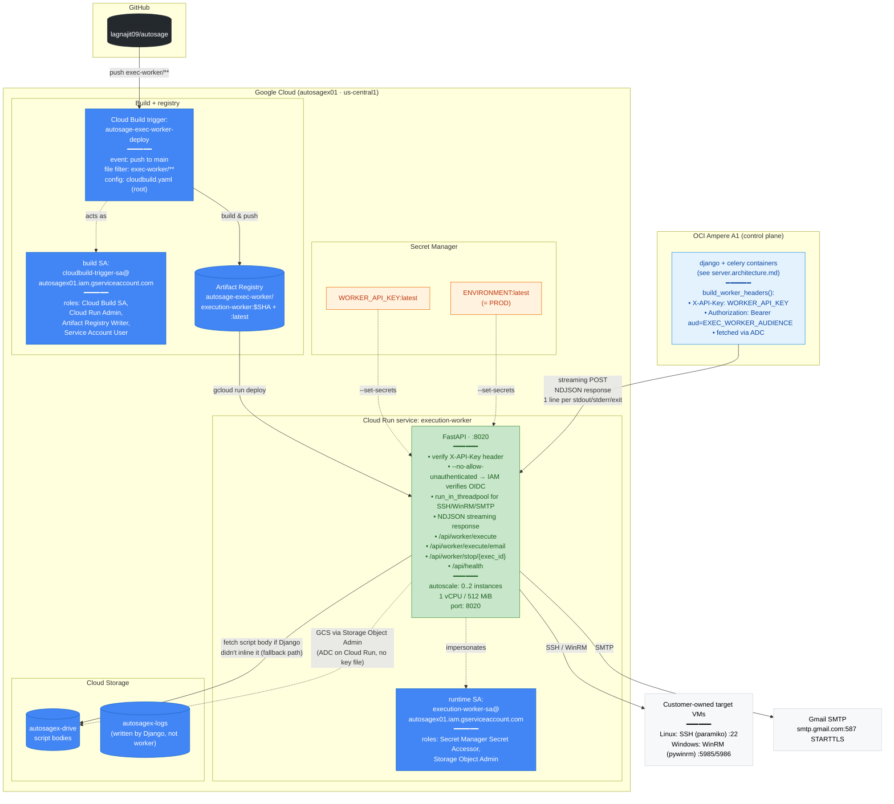
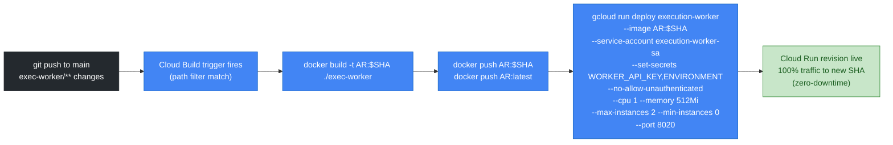
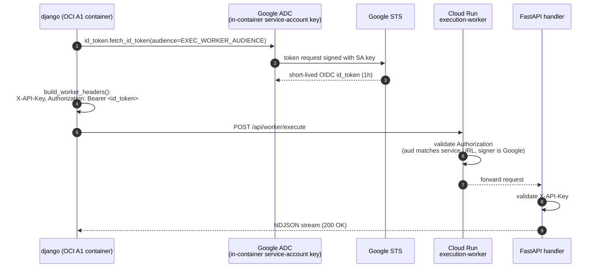

# Autosage Execution Worker — Deployment Architecture v2

**Host**: Cloud Run (autoscale 0→2) · **Region**: `us-central1` · **Repo path**: `exec-worker/**`

> **What changed since v1**: Essentially nothing. The execution plane was
> intentionally NOT migrated — Cloud Run's free tier scales to zero, so it's
> already optimal, and its OIDC-secured calling convention is something the
> OCI Django side now plays well with too (via the same `build_worker_headers()`
> helper that's been there all along). v1 doc archived at
> [./v1/worker.architecture.md](./v1/worker.architecture.md).
>
> The only relevance to the GCP→OCI migration: now that Django runs on OCI,
> requests still go _out_ to a GCP service (`https://execution-worker-<hash>.run.app`),
> authenticated by a Google OIDC identity token Django fetches from ADC.

---

## Architecture overview

---

## Why Cloud Run (not OCI too)

| Property                   | Cloud Run                                           | OCI Compute / Container Instances                                  |
| -------------------------- | --------------------------------------------------- | ------------------------------------------------------------------ |
| Scale to zero              | ✅ native, billed per request-second                | ❌ paid by the minute even when idle                               |
| Cold-start                 | ~1–2 s for our Python image                         | n/a                                                                |
| Concurrent execution slots | 80 per instance, max 2 instances → 160 concurrent   | Capped by VM cores                                                 |
| Free tier ceiling          | 180K vCPU-s + 360K GiB-s + 2M req / month           | A1 has no per-request free pricing — would burn the instance hours |
| IAM-secured invocation     | First-class via `--no-allow-unauthenticated` + OIDC | Need to roll your own auth gateway                                 |

Verdict for this workload: most workflow runs are bursty and short-lived, so paying _only when running_ via Cloud Run is the right shape. The control plane (Django + Celery + Beat) has very different characteristics — long-running, persistent state, SSE connections — and benefits from a dedicated always-on VM (A1).

---

## CI/CD flow (Cloud Build → Cloud Run)

The build runs entirely in GCP. There is **no GitHub Actions involvement** for the worker — different CI than client/server.

---

## Authentication: how Django on OCI calls Cloud Run

Even though Django no longer runs on GCP infrastructure, it still authenticates to Cloud Run with a Google OIDC ID token. The flow:

The same `gcs_key.json` that the Django container uses for GCS access is also the source of credentials for `fetch_id_token` — because Application Default Credentials picks up `GOOGLE_APPLICATION_CREDENTIALS` automatically.

`X-API-Key` is a _defense-in-depth_ check on top of IAM: even if a misconfiguration somehow flipped Cloud Run to public, a stray HTTP caller still wouldn't have the API key, and even if they had the key, they wouldn't have the OIDC token. Either layer alone would reject the request.

---

## Permissions matrix

### Cloud Run runtime SA — `execution-worker-sa@autosagex01.iam.gserviceaccount.com`

| Role                                 | Scope                                       | Why                                                                                                  |
| ------------------------------------ | ------------------------------------------- | ---------------------------------------------------------------------------------------------------- |
| `roles/secretmanager.secretAccessor` | secrets WORKER_API_KEY, ENVIRONMENT         | Inject env vars on revision boot                                                                     |
| `roles/storage.objectAdmin`          | buckets `autosagex-drive`, `autosagex-logs` | Worker reads scripts (fallback path) and could write logs (not currently used — Django uploads logs) |
| `roles/iam.serviceAccountUser`       | self                                        | Required so the SA can act as itself for token impersonation                                         |

### Cloud Build trigger SA — `cloudbuild-trigger-sa@autosagex01.iam.gserviceaccount.com`

| Role                                                      | Why                                             |
| --------------------------------------------------------- | ----------------------------------------------- |
| `roles/cloudbuild.builds.editor`                          | Run the build                                   |
| `roles/cloudbuild.builds.builder`                         | Use Cloud Build worker pool                     |
| `roles/run.admin`                                         | Update the Cloud Run service                    |
| `roles/artifactregistry.writer`                           | Push images                                     |
| `roles/logging.logWriter`                                 | Write build logs                                |
| `roles/storage.objectAdmin`                               | Cloud Build temp storage                        |
| `roles/iam.serviceAccountUser` _on_ `execution-worker-sa` | Allow `gcloud run deploy --service-account=...` |

### Caller (OCI Django) — uses `gcs_key.json` SA

| Role                                                | Why                                                   |
| --------------------------------------------------- | ----------------------------------------------------- |
| `roles/run.invoker` _on_ `execution-worker` service | Invoke `--no-allow-unauthenticated` Cloud Run service |
| `roles/storage.objectAdmin`                         | scripts + logs buckets                                |

---
