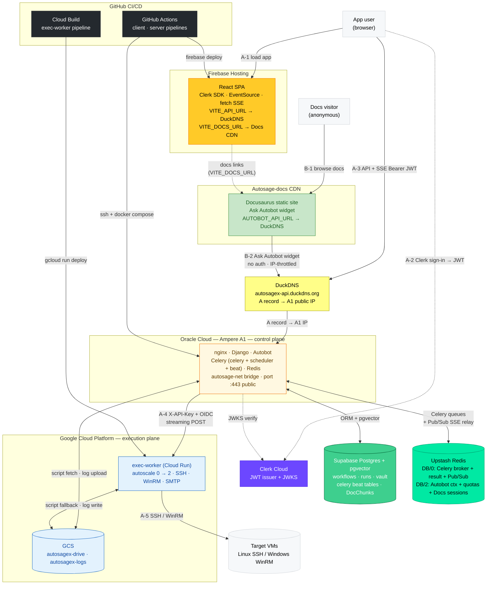
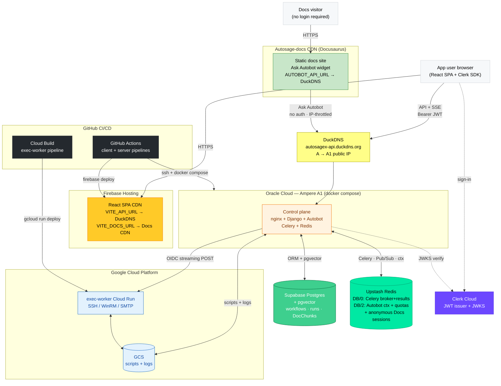
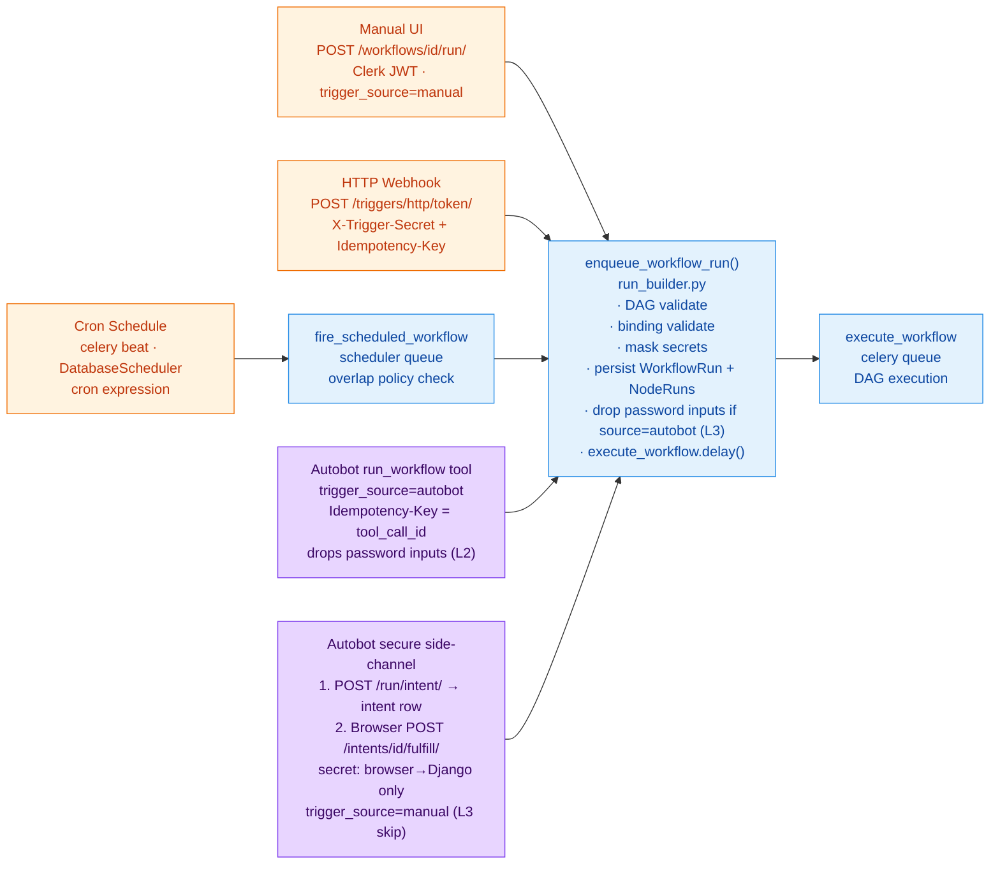
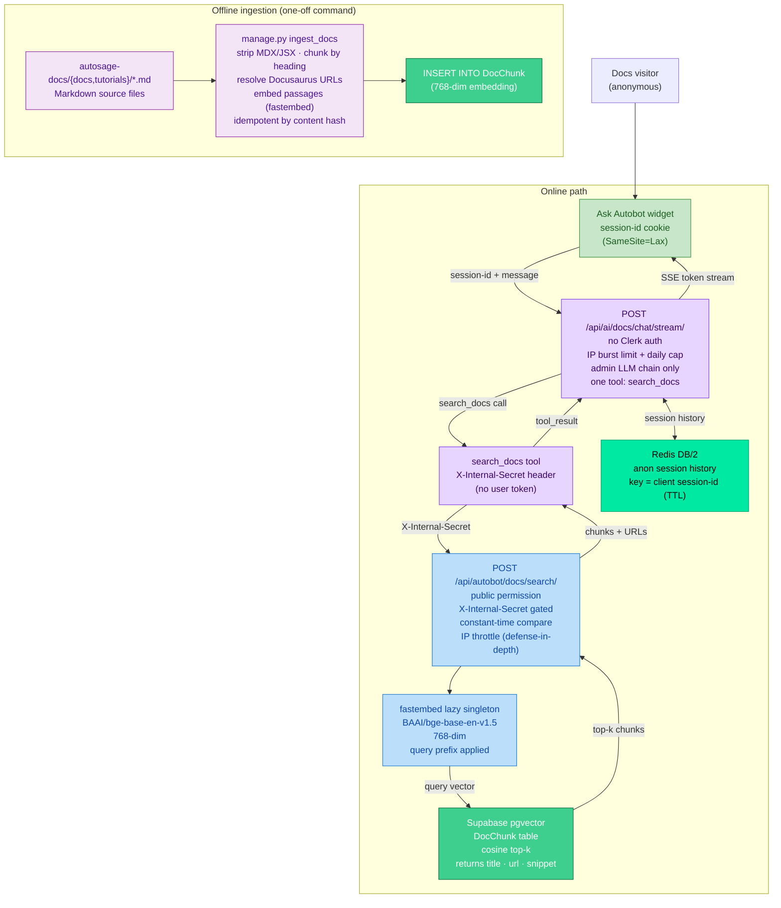
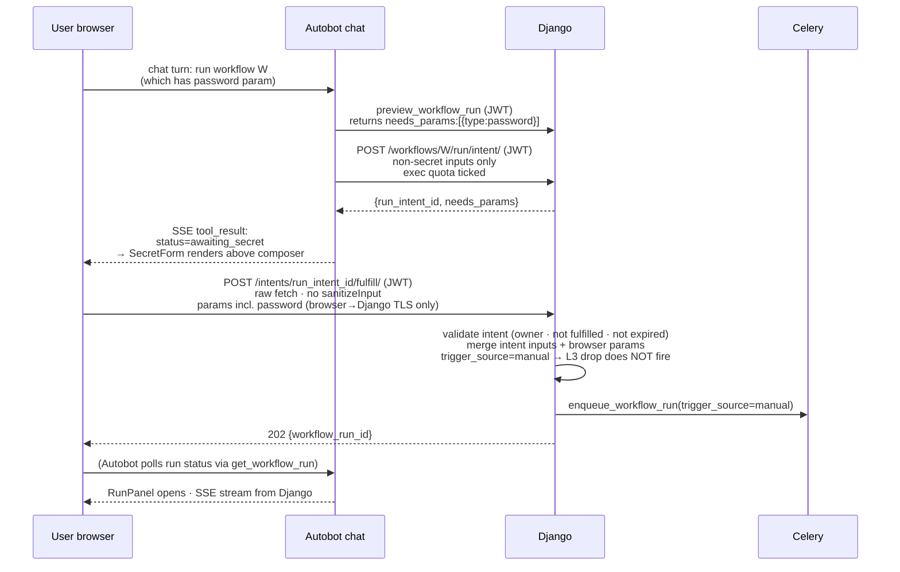

# Autosage Full-Stack Architecture — v3

> **What changed since v2**: Two new capability pillars land on top of the unchanged control/execution plane.
>
> **Pillar A — Docs RAG + public assistant**: a `DocChunk` pgvector store in Supabase, a `fastembed` model baked into the Django image for zero-cost local embeddings, an internal-secret-gated `/api/autobot/docs/search/` endpoint, a fully public SSE chat endpoint (`/api/ai/docs/chat/stream/`), and an embedded "Ask Autobot" side panel on the Autosage-docs Docusaurus site.
>
> **Pillar B — Autobot Execution Copilot**: four execution tools (`run_workflow`, `rerun_workflow`, `run_script`, `preview_workflow_run`), three investigation tools (`get_execution_histories`, `get_workflow_run`/`get_script_run`, `read_run_logs`), a secure password side-channel (`WorkflowRunIntent` → browser→Django `fulfill/`), a ReactFlow RunPanel in the SPA, and a per-user exec-quota counter in Redis DB/2 independent of the LLM admin quota.
>
> v2 docs are archived in [../v2/](../v2/).

This document gives the system-wide view. Two whole-system diagrams appear first (high-level and in-depth), followed by v3-specific flow breakdowns. For component-level details see [autobot.architecture.md](./autobot.architecture.md), [docs.architecture.md](./docs.architecture.md), [server.architecture.md](./server.architecture.md), [client.architecture.md](./client.architecture.md), and [worker.architecture.md](./worker.architecture.md).

---

## Whole-system overview — high level

Both the Autosage main application and Autosage-docs shown together. Three primary user journeys are labeled A, B, C on the arrows. Internal services within each deployment zone are collapsed — see the in-depth diagram below.

### Request journeys

**Journey A — App user, SPA + workflow execution:**
1. Browser GETs the React SPA from Firebase CDN.
2. Clerk SDK signs the user in; issues a JWT.
3. `autosagex-api.duckdns.org` resolves via DuckDNS to the A1 public IP.
4. Browser POSTs `/api/execution-engine/workflows/<id>/run/` (`Authorization: Bearer`). nginx terminates TLS, proxies to Django.
5. Django persists `WorkflowRun` + `WorkflowNodeRun` rows in Supabase, enqueues `execute_workflow` to the Redis `celery` queue, returns **202** immediately.
6. Browser opens `EventSource` on `/api/.../runs/<id>/stream/`; Django's async view subscribes to the per-run Redis Pub/Sub channel.
7. Celery worker pops the task, fetches the script body from GCS `autosagex-drive`, renders `{{param}}` placeholders.
8. Celery POSTs to Cloud Run exec-worker (`X-API-Key` + Google OIDC). Worker SSH/WinRMs the target VM, streams `stdout`/`stderr` back as NDJSON.
9. Each NDJSON chunk → Django publishes to Redis Pub/Sub → Django async SSE view → nginx (`proxy_buffering off`) → Browser in real time.
10. On completion, Celery uploads the log bundle to GCS `autosagex-logs` and updates `WorkflowRun` status in Supabase.

**Journey B — Docs visitor, Ask Autobot:**
1. Browser loads the Docusaurus site from the Docs CDN.
2. "Ask Autobot" widget POSTs to `/api/ai/docs/chat/stream/` — no auth, IP-throttled. nginx proxies to Autobot's public endpoint.
3. Autobot reads/writes the anonymous session history from Upstash Redis DB/2 (session-id cookie, TTL'd).
4. The `search_docs` tool fires: Autobot POSTs to Django `/api/autobot/docs/search/` with `X-Internal-Secret` (no user token). Django embeds the query with `fastembed` and runs a pgvector cosine top-k over `DocChunk` rows.
5. Passages + source URLs return to Autobot, which streams the answer back to the widget as SSE events.

**Journey C — App user, Autobot chat (SPA):**
1. Browser POSTs to `/api/ai/chat/` (`Authorization: Bearer`). nginx proxies to Autobot.
2. Autobot verifies the JWT (JWKS, 1 h cache), fetches thread + message history from Django (JWT forwarded), hydrates Redis DB/2 context.
3. Tool calls dispatch as `httpx` requests back to Django (JWT forwarded). Execution tools tick the exec-quota counter in Redis.
4. LLM stream (admin pool via LiteLLM, or BYO decrypted key) → SSE events (`token`, `tool_call_start`, `tool_result`, `done`) → nginx → Browser.

---

## Whole-system overview — in depth

Every individual service, every connection, and all request-response flows labeled with numbered (workflow execution) and letter-prefixed (Autobot, Docs) steps. Dashed arrows are one-way auth/notify flows; solid arrows carry request/response data.

```mermaid
flowchart TD
    classDef user     fill:#f6f8fa,stroke:#d1d5da,color:#000
    classDef firebase fill:#ffca28,stroke:#f57c00,color:#000
    classDef docsite  fill:#c8e6c9,stroke:#388e3c,color:#1b5e20
    classDef proxy    fill:#fce4ec,stroke:#c2185b,color:#880e4f
    classDef django   fill:#bbdefb,stroke:#1976d2,color:#0d47a1
    classDef autobot  fill:#e8d5ff,stroke:#7c3aed,color:#3b0764
    classDef celery   fill:#e8f5e9,stroke:#43a047,color:#1b5e20
    classDef gcp      fill:#e3f2fd,stroke:#1565c0,color:#0d47a1
    classDef supabase fill:#3ecf8e,stroke:#066b3d,color:#fff
    classDef upstash  fill:#00e9a3,stroke:#019f6f,color:#000
    classDef clerk    fill:#6c47ff,stroke:#5531e2,color:#fff
    classDef duckdns  fill:#fffe88,stroke:#a59f00,color:#000
    classDef github   fill:#24292e,stroke:#24292e,color:#fff

    %% ── Actors ──────────────────────────────────────────────────────────
    AppUser["App user browser<br/>(React SPA · Clerk SDK · EventSource)"]:::user
    DocsUser["Docs visitor (anonymous)"]:::user
    TargetVM[("Target VMs<br/>Linux SSH / Windows WinRM")]:::user
    Gmail[("Gmail SMTP")]:::user

    %% ── Auth + DNS ───────────────────────────────────────────────────────
    ClerkSvc["Clerk Cloud<br/>JWT issuer + JWKS<br/>(1 h LocMem cache)"]:::clerk
    DDNS["DuckDNS  autosagex-api.duckdns.org"]:::duckdns

    %% ── Frontends ─────────────────────────────────────────────────────────
    subgraph Firebase ["Firebase Hosting — React SPA"]
        SPA["Global CDN<br/>VITE_API_URL → DuckDNS<br/>VITE_DOCS_URL → Docs CDN"]:::firebase
    end

    subgraph DocsZone ["Autosage-docs CDN — Docusaurus"]
        DocsWidget["Static site + Ask Autobot widget<br/>session-id cookie (30 d · SameSite=Lax)<br/>AUTOBOT_API_URL → DuckDNS"]:::docsite
    end

    %% ── OCI Compose stack ─────────────────────────────────────────────────
    subgraph OCI ["Oracle Cloud — Ampere A1  (autosage-net bridge)"]
        Nginx["nginx :80/:443<br/>TLS (Let's Encrypt) · proxy_buffering off<br/>/api/* → django:8000<br/>/api/ai/* → autobot:8030"]:::proxy

        Django["Django — Uvicorn ASGI :8000<br/>REST API · SSE relay · ClerkAuthMiddleware<br/>SECURE_PROXY_SSL_HEADER<br/>fastembed lazy singleton (query-only)"]:::django

        Autobot["Autobot — FastAPI :8030<br/>Chat SSE · tool dispatch · BYO + admin LLM<br/>Exec copilot (BYO-only) · Docs RAG<br/>Public docs-chat endpoint (no auth)"]:::autobot

        CeleryW["celery worker — queue: celery<br/>execute_workflow · DAG traversal<br/>dispatch to exec-worker · relay logs<br/>upload final log bundle to GCS"]:::celery

        SchedW["celery worker — queue: scheduler<br/>fire_scheduled_workflow<br/>overlap policy check → enqueue_workflow_run"]:::celery

        Beat["celery beat — DatabaseScheduler<br/>reads PeriodicTask rows · enqueues<br/>fire_scheduled_workflow to scheduler queue"]:::celery

        LocalRedis[("Redis :6379<br/>DB/0: Celery broker + results + Pub/Sub<br/>DB/2: Autobot hot-ctx · exec quota<br/>      admin quota · Docs anon sessions")]:::upstash
    end

    %% ── GCP ───────────────────────────────────────────────────────────────
    subgraph GCP ["Google Cloud Platform"]
        ExecWorker["exec-worker — Cloud Run<br/>autoscale 0 → 2 · 1 vCPU / 512 MiB<br/>SSH (paramiko) · WinRM (pywinrm)<br/>SMTP (aiosmtplib) · NDJSON stream back"]:::gcp
        GCS_D[("GCS autosagex-drive<br/>script bodies")]:::gcp
        GCS_L[("GCS autosagex-logs<br/>stdout · stderr · logs.json")]:::gcp
        SM["Secret Manager<br/>WORKER_API_KEY · ENVIRONMENT"]:::gcp
    end

    %% ── External data ─────────────────────────────────────────────────────
    Supabase[("Supabase Postgres + pgvector<br/>workflows · scripts · vault<br/>runs · node_runs · idempotency<br/>WorkflowRunIntent · DocChunk (768-dim)")]:::supabase

    %% ── CI/CD ─────────────────────────────────────────────────────────────
    subgraph GitHub ["GitHub CI/CD"]
        GHA_C["Actions: firebase-hosting.yml<br/>trigger: client/**"]:::github
        GHA_S["Actions: deploy-server.yml<br/>trigger: server/** autobot/** nginx/**"]:::github
        GHCR[("GHCR<br/>autosage-server:latest (arm64)<br/>autosage-autobot:latest (arm64)")]:::github
        CB["Cloud Build + Artifact Registry<br/>trigger: exec-worker/**"]:::github
    end

    %% ══ WORKFLOW EXECUTION FLOW (steps 1–10) ════════════════════════════

    AppUser -->|"1 · GET / HTTPS"| SPA
    AppUser -.->|"2 · Clerk sign-in → JWT"| ClerkSvc
    AppUser -->|"3 · Bearer JWT · API + SSE"| DDNS
    DDNS    -->|"A record → A1 IP"| Nginx
    Nginx   -->|"/api/* proxy"| Django
    Django  -.->|"JWKS verify (1 h cache)"| ClerkSvc
    Django  -->|"4 · persist WorkflowRun + NodeRuns"| Supabase
    Django  -->|"5 · RPUSH execute_workflow · return 202"| LocalRedis
    CeleryW <-->|"6 · BRPOP celery queue"| LocalRedis
    CeleryW -->|"7 · fetch script body"| GCS_D
    CeleryW -->|"8 · X-API-Key + OIDC · streaming POST"| ExecWorker
    Django  -->|"8a · same path (direct script runs)"| ExecWorker
    ExecWorker -->|"SSH / WinRM"| TargetVM
    ExecWorker -->|"SMTP"| Gmail
    ExecWorker -.->|"9 · NDJSON chunks back"| Django
    Django     -->|"9a · PUBLISH per chunk"| LocalRedis
    LocalRedis -->|"9b · SUBSCRIBE → SSE frames"| Nginx
    CeleryW    -->|"10 · upload final logs"| GCS_L
    Django     -->|"10a · upload log bundle"| GCS_L

    %% ══ AUTOBOT CHAT FLOW (steps A1–A4) ════════════════════════════════

    Nginx   -->|"/api/ai/* proxy"| Autobot
    Autobot -.->|"A1 · JWKS verify (1 h cache)"| ClerkSvc
    Autobot <-->|"A2 · thread · history · tool calls<br/>Bearer JWT forwarded on every call"| Django
    Autobot <-->|"A3 · hot-ctx · exec quota · admin quota"| LocalRedis

    %% ══ DOCS RAG FLOW (steps D1–D4) ════════════════════════════════════

    DocsUser   -->|"D1 · GET /docs"| DocsWidget
    DocsWidget -->|"D2 · POST /api/ai/docs/chat/stream/<br/>no auth · IP-throttled · session-id"| DDNS
    Autobot    -->|"D3 · X-Internal-Secret<br/>POST /api/autobot/docs/search/"| Django
    Django     <-->|"D4 · fastembed query + pgvector top-k"| Supabase
    Autobot    <-->|"D5 · anon session history (TTL)"| LocalRedis

    %% ══ SCHEDULE TRIGGER FLOW ═══════════════════════════════════════════

    Beat   -->|"read PeriodicTask rows"| Supabase
    Beat   -->|"RPUSH fire_scheduled_workflow"| LocalRedis
    SchedW <-->|"BRPOP scheduler queue"| LocalRedis

    %% ══ EXEC-WORKER ═════════════════════════════════════════════════════

    ExecWorker -->|"script fallback"| GCS_D
    SM -.->|"injected as env vars"| ExecWorker

    %% ══ SPA docs link ════════════════════════════════════════════════════

    SPA -.->|"docs link (VITE_DOCS_URL)"| DocsWidget

    %% ══ CI/CD ════════════════════════════════════════════════════════════

    GHA_C -->|"firebase deploy"| SPA
    GHA_S -->|"build arm64 images"| GHCR
    GHA_S -->|"ssh + docker compose pull+up"| OCI
    GHCR  -->|"docker pull on deploy"| OCI
    CB    -->|"build + gcloud run deploy"| ExecWorker
```

### Flow reference

**Workflow execution (1–10):**

| Step | What happens |
|---|---|
| 1 | Browser GETs the SPA from Firebase CDN. |
| 2 | Clerk SDK signs the user in; a JWT is issued. |
| 3 | Browser POSTs `/workflows/<id>/run/` with `Authorization: Bearer`. DuckDNS resolves to the A1 IP; nginx terminates TLS and proxies to Django. |
| 4 | Django persists `WorkflowRun` + `WorkflowNodeRun` rows in Supabase (queued). |
| 5 | Django RPUSHes `execute_workflow` onto the Redis `celery` queue and returns **202** immediately. Browser opens `EventSource` on `/runs/<id>/stream/`; Django async view subscribes to `workflow_run:<id>:logs` on Redis. |
| 6 | Celery worker BRPOPs the task from the `celery` queue. |
| 7 | Celery fetches the script body from GCS `autosagex-drive`, renders `{{param}}` placeholders. |
| 8 | Celery POSTs to Cloud Run exec-worker (`X-API-Key` + Google OIDC). Worker SSH/WinRMs the target VM, streams `stdout`/`stderr` back as NDJSON. |
| 9 | Each NDJSON chunk → Django publishes to `workflow_run:<id>:logs` on Redis → Django async SSE view → nginx (`proxy_buffering off`, `proxy_read_timeout 3600s`) → Browser in real time. |
| 10 | Celery uploads `stdout`/`stderr`/`logs.json` to GCS `autosagex-logs` and writes final `WorkflowRun` status to Supabase. |

**Autobot chat (A1–A4):**

| Step | What happens |
|---|---|
| A1 | Browser POSTs `/api/ai/chat/` (Bearer JWT). nginx strips the `/api/ai` prefix and proxies to Autobot. Autobot verifies the JWT via Clerk JWKS (1 h LocMem cache). |
| A2 | Autobot fetches the thread + message history from Django (JWT forwarded verbatim). Context is hydrated from or written to Redis DB/2 (7200 s TTL). |
| A3 | Tool calls dispatch as `httpx` requests back to Django with the JWT forwarded. Execution tools tick the Redis exec-quota counter. |
| A4 | LLM stream (admin pool via LiteLLM, or BYO key decrypted per-request) → SSE events (`token`, `tool_call_start`, `tool_result`, `done`) → nginx → Browser. |

**Docs RAG (D1–D5):**

| Step | What happens |
|---|---|
| D1 | Browser loads the Docusaurus site from the Docs CDN. |
| D2 | "Ask Autobot" widget POSTs `/api/ai/docs/chat/stream/` — no auth, IP-throttled. nginx proxies to Autobot's public endpoint. |
| D3 | `search_docs` tool fires: Autobot POSTs to Django `/api/autobot/docs/search/` with `X-Internal-Secret` header (no user token, no Clerk JWT on this path). |
| D4 | Django embeds the query with the `fastembed` lazy singleton (768-dim, BGE instruction prefix) and runs a pgvector cosine top-k over `DocChunk` rows in Supabase. Returns passages + source URLs. |
| D5 | Autobot reads/writes the anonymous session history from Redis DB/2 (key = client-generated session-id, charset/length clamped, TTL'd). Answer SSE-streams back through nginx to the widget. |

---

## v3 delta — high-level

Major deployment zones and their primary communication flows, annotated to highlight what is new or changed in v3. See the whole-system diagrams above for the complete picture.

---

## v3 delta — in depth

All individual services, data flows, auth mechanisms, and v3-specific paths (Docs RAG, Execution Copilot, Password Side-Channel), annotated with what is new in v3. Dashed arrows are auth/verify-only flows; solid arrows carry data.

```mermaid
flowchart TD
    classDef user     fill:#f6f8fa,stroke:#d1d5da,color:#000
    classDef firebase fill:#ffca28,stroke:#f57c00,color:#000
    classDef docsite  fill:#c8e6c9,stroke:#388e3c,color:#1b5e20
    classDef proxy    fill:#fce4ec,stroke:#c2185b,color:#880e4f
    classDef django   fill:#bbdefb,stroke:#1976d2,color:#0d47a1
    classDef autobot  fill:#e8d5ff,stroke:#7c3aed,color:#3b0764
    classDef celery   fill:#e8f5e9,stroke:#43a047,color:#1b5e20
    classDef gcp      fill:#e3f2fd,stroke:#1565c0,color:#0d47a1
    classDef supabase fill:#3ecf8e,stroke:#066b3d,color:#fff
    classDef upstash  fill:#00e9a3,stroke:#019f6f,color:#000
    classDef clerk    fill:#6c47ff,stroke:#5531e2,color:#fff
    classDef duckdns  fill:#fffe88,stroke:#a59f00,color:#000
    classDef github   fill:#24292e,stroke:#24292e,color:#fff
    classDef secret   fill:#fff9c4,stroke:#f9a825,color:#5d4037

    %% ── External actors ────────────────────────────────────────────────
    AppUser["App user browser<br/>(React SPA · Clerk SDK · EventSource)"]:::user
    DocsUser["Docs visitor<br/>(anonymous)"]:::user
    TargetVM[("Target VMs<br/>Linux SSH / Windows WinRM")]:::user
    Gmail[("Gmail SMTP")]:::user

    %% ── Identity ────────────────────────────────────────────────────────
    ClerkSvc["Clerk Cloud<br/>JWT issuer + JWKS<br/>(1h LocMem cache on verify)"]:::clerk
    DDNS["DuckDNS<br/>autosagex-api.duckdns.org"]:::duckdns

    %% ── Frontends ───────────────────────────────────────────────────────
    subgraph Firebase ["Firebase Hosting — React SPA"]
        SPA["Global CDN<br/>VITE_API_URL → DuckDNS<br/>VITE_DOCS_URL → Docs CDN"]:::firebase
    end

    subgraph DocsZone ["Autosage-docs CDN (Docusaurus)"]
        DocsWidget["Static site<br/>Ask Autobot widget<br/>session-id cookie (30d)<br/>AUTOBOT_API_URL → DuckDNS"]:::docsite
    end

    %% ── OCI Compose stack ──────────────────────────────────────────────
    subgraph OCI ["Oracle Cloud — Ampere A1  (autosage-net bridge)"]

        Nginx["nginx :80/:443<br/>TLS terminator (Let's Encrypt)<br/>SSE proxy_buffering off<br/>ACME http-01 webroot"]:::proxy

        subgraph DjangoSvc ["Django (Uvicorn ASGI :8000)"]
            Django["REST API + SSE relay<br/>Clerk JWT verify<br/>fastembed lazy singleton<br/>(query-only — never in workers)"]:::django
        end

        subgraph AutobotSvc ["Autobot (FastAPI :8030)"]
            Autobot["Chat SSE + tool dispatch<br/>Exec copilot tools<br/>Docs RAG (search_docs)<br/>Public docs-chat endpoint"]:::autobot
        end

        CeleryW["celery worker<br/>queue: celery<br/>execute_workflow task"]:::celery
        SchedW["celery worker<br/>queue: scheduler<br/>fire_scheduled_workflow task"]:::celery
        Beat["celery beat<br/>DatabaseScheduler<br/>(reads PeriodicTask from Supabase)"]:::celery
        Certbot["certbot one-shot<br/>webroot challenge<br/>renewal via host cron"]:::celery
        LocalRedis[("Redis :6379<br/>DB/0: Celery broker + results<br/>DB/2: Autobot hot-ctx (7200s TTL)<br/>      exec quota + admin quota<br/>      Docs anon sessions (TTL)")]:::upstash
    end

    %% ── GCP execution plane ────────────────────────────────────────────
    subgraph GCP ["Google Cloud Platform"]
        ExecWorker["exec-worker (Cloud Run)<br/>autoscale 0 → 2<br/>SSH · WinRM · SMTP NDJSON"]:::gcp
        GCS_D[("GCS autosagex-drive<br/>script bodies<br/>scripts/{user}/{id}/...")]:::gcp
        GCS_L[("GCS autosagex-logs<br/>stdout · stderr · logs.json<br/>per execution")]:::gcp
        SM["Secret Manager<br/>WORKER_API_KEY · ENVIRONMENT"]:::gcp
    end

    %% ── External data stores ───────────────────────────────────────────
    Supabase[("Supabase Postgres + pgvector<br/>workflows · scripts · vault<br/>runs · node_runs · idempotency<br/>WorkflowRunIntent<br/>django_celery_beat tables<br/>DocChunk (768-dim embeddings)")]:::supabase

    %% ── CI/CD ──────────────────────────────────────────────────────────
    subgraph GitHub ["GitHub"]
        Repo[("lagnajit09/autosage")]:::github
        GHA_C["Actions: firebase-hosting.yml<br/>trigger: client/**"]:::github
        GHA_S["Actions: deploy-server.yml<br/>trigger: server/** nginx/**"]:::github
        GHCR[("GHCR<br/>autosage-server:latest (arm64)")]:::github
        CB["Cloud Build<br/>trigger: exec-worker/**"]:::github
        AR[("Artifact Registry<br/>execution-worker:SHA")]:::github
    end

    %% ── User → frontend ─────────────────────────────────────────────────
    AppUser -->|"1. GET / HTTPS"| SPA
    AppUser -.->|"2. Clerk sign-in"| ClerkSvc
    AppUser -->|"3. API + SSE Bearer JWT"| DDNS
    DDNS -->|"A → A1 public IP"| Nginx
    DocsUser -->|"GET /docs"| DocsWidget

    %% ── Docs widget → OCI (new in v3, Pillar A) ─────────────────────────
    DocsWidget -->|"POST /api/ai/docs/chat/stream/<br/>no auth · IP-throttled<br/>session-id in body"| Nginx

    %% ── nginx routing ────────────────────────────────────────────────────
    Nginx -->|"/api/* → django:8000<br/>X-Forwarded-Proto:https"| Django
    Nginx -->|"/api/ai/* → autobot:8030<br/>(strips /api/ai prefix)"| Autobot

    %% ── Autobot → Django: two auth modes ────────────────────────────────
    Autobot -->|"Bearer JWT forwarded<br/>CRUD + run + rerun endpoints<br/>(all tool calls except docs search)"| Django
    Autobot -->|"X-Internal-Secret header<br/>POST /api/autobot/docs/search/<br/>(no user token — public path)"| Django

    %% ── Django data plane ────────────────────────────────────────────────
    Django <-->|"ORM  conn_max_age 600s<br/>+ pgvector cosine search<br/>(DocChunk top-k)"| Supabase
    Django <-->|"Celery enqueue<br/>+ PUBLISH workflow_run:{id}:logs"| LocalRedis
    Django <-->|"download scripts<br/>upload logs"| GCS_D

    %% ── Autobot ↔ Redis (ctx, quotas, docs sessions) ────────────────────
    Autobot <-->|"DB/2: thread ctx · exec quota<br/>admin quota · docs anon sessions"| LocalRedis

    %% ── Celery workers ────────────────────────────────────────────────────
    CeleryW <-->|"BRPOP celery queue"| LocalRedis
    SchedW  <-->|"BRPOP scheduler queue"| LocalRedis
    Beat    -->|"RPUSH scheduler queue<br/>fire_scheduled_workflow"| LocalRedis
    Beat    -->|"read PeriodicTask rows"| Supabase

    %% ── Auth verify ──────────────────────────────────────────────────────
    Django  -.->|"JWKS verify (1h cache)"| ClerkSvc
    Autobot -.->|"JWKS verify (1h cache)"| ClerkSvc

    %% ── Execution dispatch ───────────────────────────────────────────────
    Django  -->|"8. streaming POST /api/worker/execute<br/>X-API-Key + OIDC bearer"| ExecWorker
    CeleryW -->|"same path as Django<br/>X-API-Key + OIDC bearer"| ExecWorker

    %% ── Exec-worker internals ────────────────────────────────────────────
    ExecWorker -->|"SSH / WinRM"| TargetVM
    ExecWorker -->|"SMTP TLS"| Gmail
    ExecWorker -->|"fetch script (fallback)"| GCS_D
    ExecWorker -->|"upload logs"| GCS_L
    SM -.->|"injected as env vars"| ExecWorker

    %% ── SSE log relay ────────────────────────────────────────────────────
    ExecWorker -.->|"NDJSON chunks"| Django
    Django     -->|"PUBLISH per chunk"| LocalRedis
    LocalRedis -->|"SUBSCRIBE → SSE frames"| Nginx

    %% ── Final log upload ─────────────────────────────────────────────────
    Django -->|"10. upload stdout/stderr/logs.json"| GCS_L

    %% ── TLS cert ─────────────────────────────────────────────────────────
    Certbot <-->|"ACME http-01 challenge"| Nginx

    %% ── CI/CD ────────────────────────────────────────────────────────────
    Repo --> GHA_C
    Repo --> GHA_S
    Repo --> CB
    GHA_C -->|"firebase deploy"| SPA
    GHA_S -->|"build arm64 image"| GHCR
    GHA_S -->|"ssh + scp + docker compose pull+up"| OCI
    GHCR  -->|"docker pull on deploy"| OCI
    CB    -->|"build + push"| AR
    AR    -->|"gcloud run deploy"| ExecWorker
```

---

## Component summary

| Component | Deployment | What it does | v3 delta |
|---|---|---|---|
| **React SPA** | Firebase Hosting | UI, Clerk sign-in, SSE consumer, RunPanel, SecretForm | `VITE_DOCS_URL` env var → Docs CDN link |
| **Autosage-docs** | Docs CDN (Docusaurus) | Public documentation site + Ask Autobot widget | **NEW** — Pillar A |
| **nginx** | OCI A1 compose | TLS terminator (Let's Encrypt), SSE-safe proxy, ACME webroot | Unchanged |
| **Django (Uvicorn ASGI)** | OCI A1 compose | REST API, SSE relay, Clerk JWT verify, `enqueue_workflow_run` | `DocChunk` + pgvector; `fastembed` lazy singleton; `docs/search/` endpoint; `WorkflowRunIntent` + `fulfill/` endpoint; `run/async/` script endpoint |
| **Autobot (FastAPI)** | OCI A1 compose, :8030 | Chat SSE, tool dispatch, BYO LLM, summarization, usage dashboard | **Pillar B**: execution tools + investigation tools + RunPanel + SecretForm; **Pillar A**: `search_docs` tool + public docs-chat endpoint |
| **Celery worker (celery queue)** | OCI A1 compose | `execute_workflow` — DAG traversal, exec-worker dispatch, log relay | Unchanged |
| **Celery Beat** | OCI A1 compose | Cron dispatcher via `DatabaseScheduler` | Unchanged |
| **Celery worker (scheduler queue)** | OCI A1 compose | `fire_scheduled_workflow` — fires scheduled runs, overlap check | Unchanged |
| **exec-worker (FastAPI)** | Cloud Run (0→2) | SSH / WinRM / SMTP execution, NDJSON streaming | Unchanged |
| **Supabase Postgres** | Supabase Cloud | Workflows, runs, node_runs, vault, Celery Beat tables | `pgvector` extension + `DocChunk` table (768-dim embeddings); `WorkflowRunIntent` table |
| **Upstash Redis** | Upstash Cloud | Celery broker+results (DB/0), Pub/Sub log relay | DB/2 gains exec-quota counter + anonymous Docs session memory (TTL) |
| **GCS autosagex-drive** | Google Cloud Storage | Script bodies | Unchanged |
| **GCS autosagex-logs** | Google Cloud Storage | Per-execution stdout/stderr/logs.json | Unchanged |
| **Clerk** | Clerk Cloud | JWT issuance + JWKS | Unchanged |
| **DuckDNS** | DuckDNS service | DDNS for Let's Encrypt HTTP-01 | Unchanged |

---

## Trigger sources (all converge on `enqueue_workflow_run()`)

---

## Docs RAG flow (new in v3 — Pillar A)

---

## Password side-channel flow (new in v3 — Pillar B)

Secret travels **browser → Django over TLS only**. Autobot never holds a plaintext password — only a `run_intent_id`.

---

## Security boundaries

| Boundary | Mechanism |
|---|---|
| Internet → nginx | TCP 80/443 only. OCI VCN Security List + host iptables both enforce. |
| nginx → Django | Internal bridge only. Django `expose: ["8000"]` — never host-mapped. |
| nginx → Autobot | Internal bridge only. Autobot `expose: ["8030"]` — never host-mapped. |
| Browser → Django (authenticated) | Clerk JWT in `Authorization: Bearer`, verified against JWKS (1h LocMem cache). DRF default: `IsAuthenticated`. |
| Browser → Django (docs fulfill) | Same Clerk JWT. Owner-scope enforced: intent's `user` must match token `sub`. |
| Docs widget → Autobot (public) | No auth. Bounded: IP burst limit + per-IP daily cap + single `search_docs` tool + bounded message/history/tool rounds. Admin LLM chain only. |
| Autobot → Django (tool calls) | User's Clerk JWT forwarded verbatim on every httpx call. No service-account elevation — Django query scoping enforces tenant isolation automatically. |
| Autobot → Django (docs search) | `X-Internal-Secret` header, constant-time compare, fails closed when unset. Redacted from logs. Protected routes ignore the secret — auth is decided server-side per route. |
| Public webhook → Django | `X-Trigger-Secret` bcrypt-verified + required `Idempotency-Key`. Per-token rate limit. |
| Django → exec-worker | `X-API-Key` header + Google OIDC ID token (audience = `EXEC_WORKER_AUDIENCE`). Cloud Run is `--no-allow-unauthenticated`. |
| Django / worker → GCS | Service-account JSON key (`:ro` mount) or ADC on Cloud Run. |
| Django ↔ Supabase | TLS Postgres, `conn_max_age=600`, `conn_health_checks=True`. |
| Django ↔ Redis | Upstash `rediss://` (TLS), keepalive, `retry_on_timeout`. |
| Vault / HTTP-trigger secrets at rest | Fernet-encrypted (`EncryptedCharField`). HTTP-trigger secret stored as bcrypt hash; plaintext shown once. |
| Password param safety (4 layers) | L1: `mask_password_params()` strips values before LLM sees them. L2: `run_workflow` drops password keys before POST. L3: `enqueue_workflow_run` drops them again when `trigger_source=="autobot"`. L4: secure side-channel routes secrets browser→Django, never through Autobot. |
| Autobot exec mode | BYO-key only — admin/shared-key turns are refused upfront before any LLM call or quota tick. |
| Autobot tool-mode floor | `_effective_allowed_tools(mode, panel)` intersects mode floor and panel floor at both advertise-time and dispatch-time. |
| Docs session id | Non-credential: names a Redis key only (length/charset clamped), never addresses a DB row, carries no authorization weight. |
