# Autobot Service Architecture — v3

> Autobot is Autosage's built-in AI assistant: a standalone **FastAPI** service (Python 3.12, Uvicorn) on the OCI A1 VM, routed by nginx at `/api/ai/*`. v3 ships the full feature set: streaming chat, BYO LLM keys, execution copilot (Pillar B), and the public docs-RAG chat endpoint (Pillar A).

For system-wide context see [architecture.md](./architecture.md).

---

## Service topology

```mermaid
flowchart TD
    classDef ext     fill:#f6f8fa,stroke:#d1d5da,color:#000
    classDef proxy   fill:#fce4ec,stroke:#c2185b,color:#880e4f
    classDef router  fill:#e8d5ff,stroke:#7c3aed,color:#3b0764
    classDef tool    fill:#f3e5f5,stroke:#8e24aa,color:#4a148c
    classDef llm     fill:#ede7f6,stroke:#5e35b1,color:#1a237e
    classDef django  fill:#bbdefb,stroke:#1976d2,color:#0d47a1
    classDef redis   fill:#00e9a3,stroke:#019f6f,color:#000
    classDef quota   fill:#fff9c4,stroke:#f9a825,color:#5d4037

    Nginx["nginx<br/>(strips /api/ai prefix)"]:::proxy

    subgraph Autobot ["autobot/ — FastAPI :8030"]
        Auth["auth.py<br/>Clerk JWKS verify<br/>extracts sub + raw JWT<br/>JWT stripped from logs"]:::router

        subgraph ChatRouter ["routers/chat.py"]
            AuthChat["POST /chat/<br/>Clerk JWT required<br/>mode: research/generation/execution"]:::router
            PublicChat["POST /docs/chat/stream/<br/>no Clerk auth<br/>IP burst + daily cap"]:::router
        end

        subgraph ConvLayer ["conversation/"]
            Cache["cache.py<br/>Redis DB/2 get/set/invalidate<br/>TTL refresh on access"]:::redis
            Persist["persistence.py<br/>DjangoClient httpx wrapper<br/>Bearer JWT forwarded<br/>OR X-Internal-Secret (docs path)"]:::django
            Summarizer["summarizer.py<br/>LLM-compress older history<br/>persist Summary row via Django<br/>called when ctx > target ratio"]:::router
        end

        subgraph LLMLayer ["llm/"]
            Resolver["client.py resolve_for_thread<br/>BYO: decrypt once per request<br/>Admin: OpenRouter + fallback chain"]:::llm
            ToolSchemas["tools.py<br/>JSON Schema per tool<br/>get_tool_schemas(allowed_set)"]:::tool
        end

        subgraph ToolLayer ["tools/ — dispatcher + implementations"]
            Dispatch["dispatcher.py dispatch_tool<br/>ToolContext ContextVar<br/>mode floor re-check at dispatch"]:::tool
            ScriptTools["script tools<br/>list · read · create · update"]:::tool
            WorkflowTools["workflow tools<br/>list · read · create · update"]:::tool
            VaultTool["list_vault_resources<br/>(metadata only — no secret values)"]:::tool
            ExecTools["execution tools (BYO + execution mode only)<br/>preview_workflow_run<br/>run_workflow · rerun_workflow<br/>run_script"]:::tool
            InvestTools["investigation tools<br/>get_execution_histories<br/>get_workflow_run · get_script_run<br/>read_run_logs (GCS text, tailed 6 KB)"]:::tool
            DocsTool["search_docs<br/>(public path · X-Internal-Secret)"]:::tool
        end

        Prompts["prompts.py<br/>research / generation / execution prompts<br/>docs standalone prompt<br/>mode floor frozensets<br/>_effective_allowed_tools(mode, panel)"]:::router

        subgraph QuotaLayer ["quota"]
            AdminQ["admin quota<br/>autobot:admin_quota:sub:date<br/>Redis DB/2 · 26h TTL<br/>fail-open · BYO turns exempt"]:::quota
            ExecQ["exec quota<br/>autobot:exec_quota:sub:date<br/>Redis DB/2 · 26h TTL<br/>ticked at run_workflow / run_script<br/>BYO-only gate"]:::quota
        end
    end

    Django["Django REST API<br/>(all tool calls proxy here)"]:::django
    Redis["Redis DB/2<br/>thread ctx · quotas · docs sessions"]:::redis

    Nginx -->|"/chat/ (JWT)"| Auth
    Nginx -->|"/docs/chat/stream/ (no auth)"| PublicChat
    Auth --> AuthChat
    AuthChat --> Prompts
    AuthChat --> ConvLayer
    PublicChat --> DocsTool
    PublicChat <--> Cache
    ConvLayer --> Cache
    ConvLayer --> Persist
    AuthChat --> Resolver
    AuthChat --> ToolSchemas
    AuthChat --> Dispatch
    PublicChat --> Resolver
    Dispatch --> ScriptTools
    Dispatch --> WorkflowTools
    Dispatch --> VaultTool
    Dispatch --> ExecTools
    Dispatch --> InvestTools
    Dispatch --> DocsTool
    ScriptTools --> Persist
    WorkflowTools --> Persist
    VaultTool --> Persist
    ExecTools --> Persist
    InvestTools --> Persist
    ExecTools --> ExecQ
    AuthChat --> AdminQ
    Persist --> Django
    Cache --> Redis
    AdminQ --> Redis
    ExecQ --> Redis
```



---

## Chat turn lifecycle

```
1. Verify JWT → user_sub + raw_jwt                        (auth.py)
2. POST user message to Django → auth check + persist     (persistence.py)
3. asyncio.gather(get_thread, get_history)                (parallel, 1 round-trip)
4. Hydrate hot ctx from Redis, or build from history      (cache.py)
5. Pre-compact: tool msgs > 2 KB → one-line digest        (defers summarization 5–10 turns)
6. Tiktoken count → if > target ratio: summarize          (summarizer.py)
7. Resolve LLM client                                     (llm/client.py)
   BYO:   one decrypt call, plaintext key never cached
   Admin: try AUTOBOT_ADMIN_FALLBACKS chain on retryable error
8. Stream deltas → event:token
   On tool call:
     emit event:tool_call_start
     dispatch_tool() → mode floor re-check → tool impl
     emit event:tool_result
     loop (hard cap: AUTOBOT_MAX_TOOL_ROUNDS=10)
9. Persist final assistant message (token counts) to Django
10. Refresh Redis ctx cache
11. emit event:done
```

---

## Tool mode floors

Tools available per mode (intersected with panel floor at advertise + dispatch):

| Tool | research | generation | execution |
|---|:---:|:---:|:---:|
| list/read scripts & workflows | ✓ | ✓ | ✓ |
| list_vault_resources | ✓ | ✓ | ✓ |
| get_execution_histories | ✓ | ✓ | ✓ |
| get_workflow_run / get_script_run | ✓ | ✓ | ✓ |
| read_run_logs | ✓ | ✓ | ✓ |
| create / update scripts & workflows | | ✓ | ✓ |
| preview_workflow_run | | | ✓ |
| run_workflow / rerun_workflow | | | ✓ |
| run_script | | | ✓ |

**Execution mode is BYO-key only.** Admin/shared-key turns are refused before any LLM call (`_execution_mode_blocked` check at stream entry).

---

## Admin LLM pool resilience

Two-tier fallback, evaluated once per turn before the first token is streamed:

```
Tier 1 (inside OpenRouter):
  extra_body={"models": [...], "route": "fallback"}
  OpenRouter tries multiple free models server-side within one request.

Tier 2 (autobot chain):
  AUTOBOT_ADMIN_FALLBACKS env list, tried in order on retryable errors.
  Round-1 only — before any token is streamed to the client.
```

---

## Docs-chat public endpoint

`POST /api/ai/docs/chat/stream/` — the only unauthenticated surface on the AI service.

| Constraint | Value |
|---|---|
| Auth | None — IP-keyed throttle only |
| Rate limit | IP burst (configurable) + per-IP daily cap (fail-open) |
| LLM chain | Admin pool only — no user-supplied key on public path |
| Tools advertised | `search_docs` only |
| Tools dispatched | `search_docs` only (dispatch re-check) |
| Message length | Bounded |
| History length | Bounded (replayed from Redis anon session) |
| Tool-call rounds | Hard cap |
| Session memory | Redis DB/2, key = client-generated session-id (clamped charset/length) |
| Answer persistence | None — no `Message` row, no Django call on this path |

Session-id is **not a credential** — it names a Redis key only, never addresses a DB row.
