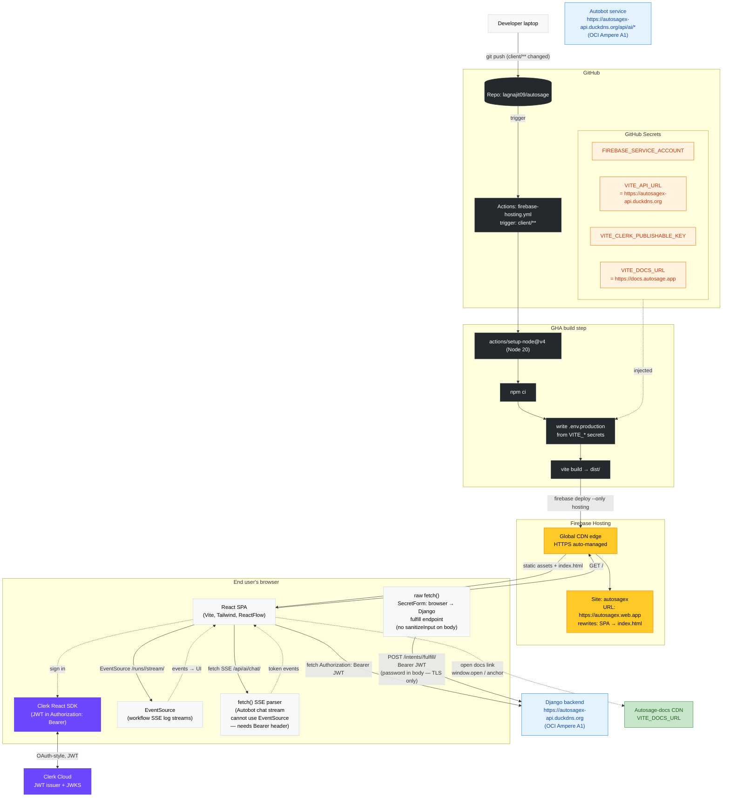
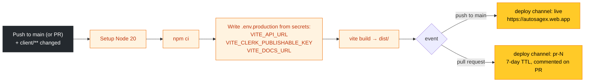

# Autosage React Client — Deployment Architecture v3

**Hosting**: Firebase Hosting · **Build**: Vite + Tailwind + Radix UI · **Repo path**: `client/**`

> **What changed since v2**: Three additions driven by Pillar A and Pillar B.
>
> - `VITE_DOCS_URL` GitHub Secret added — the Docs CDN origin embedded into the SPA build, consumed by the "Documentation" links in Autosage app.
> - **Execution copilot UI (Pillar B)**: `RunPanel`, `RunGraph`, `RunCard`, `SecretForm`, `ToolResultRenderer`, and `runStore` added under `client/src/components/Autobot/Chat/run/`. `SecretForm` uses a raw `fetch` (not `apiRequest`) to POST the password-carrying fulfill request browser→Django directly.
> - **Autobot (Autosage AI Agent)**: Autosage's own AI agent with built-in tools and BYO models
>
> v2 doc archived at [../v2/client.architecture.md](../v2/client.architecture.md).

---

## Architecture overview



---

## CI/CD flow (GitHub Actions → Firebase)



---

## New client-side modules (v3)

### Docs links — `src/lib/api-client.ts`

```typescript
export const DOCS_BASE_URL =
  import.meta.env.VITE_DOCS_URL || "http://localhost:3000";
```

Imported and rendered as `<a href={DOCS_BASE_URL} target="_blank">` in:

| Location                                                        | Trigger                                          |
| --------------------------------------------------------------- | ------------------------------------------------ |
| `Dashboard/Sidebar.tsx` — below "New Workflow" button           | Always visible                                   |
| `LeftNav.tsx` — bottom section (desktop tooltip, mobile button) | Always visible                                   |
| `Dashboard.tsx` — empty-state CTA                               | When account has no workflows/scripts/executions |
| `ScriptEditor/FileExplorerSidebar.tsx` — empty-state            | When no script files exist                       |

### RunPanel module — `src/components/Autobot/Chat/run/`

| File                   | Purpose                                                                                                                                                                              |
| ---------------------- | ------------------------------------------------------------------------------------------------------------------------------------------------------------------------------------ |
| `runStore.ts`          | One SSE/poll per run-id; shared via `useSyncExternalStore`. Reuses `streamLogs` parse from `WorkflowExecution.tsx`. Polls `…/status/` for scripts. Auto-terminates on finished runs. |
| `RunPanelProvider.tsx` | Drawer state + `requestSecret` / `pendingSecret` context.                                                                                                                            |
| `RunGraph.tsx`         | Read-only ReactFlow canvas. Reuses builder node positions, colors live from `nodeStatuses` (running/success/failed/skipped).                                                         |
| `RunPanel.tsx`         | Drawer body: workflow → Graph / Logs / Response tabs; script → Logs / Details.                                                                                                       |
| `RunCard.tsx`          | Compact inline renderer with cancel button. Expands into drawer.                                                                                                                     |
| `SecretForm.tsx`       | Composer-anchored confirmation form. Renders above chat input (`bottom-full`). Uses raw `fetch` — NOT `apiRequest` — so `sanitizeInput` does not run on the password value.          |
| `intents.ts`           | `fulfillRunIntent()` — raw fetch, no `sanitizeInput`, includes `Idempotency-Key` header.                                                                                             |
| `RunFields.tsx`        | `ParamGrid` (read-only), `SecretField` (enabled in v3), `ParamInput` for editable non-secret params.                                                                                 |

### ToolResultRenderer — `src/components/Autobot/Chat/ToolResultRenderer.tsx`

Classifies completed non-error tool results into rich UI:

| Tool result                                      | Component                                              |
| ------------------------------------------------ | ------------------------------------------------------ |
| `run_workflow` / `rerun_workflow` / `run_script` | `RunCard` → expands into `RunPanel` drawer             |
| `preview_workflow_run`                           | `PreviewCard` — targets, masked inputs, ready/blocking |
| `get_workflow_run` / `get_script_run`            | `RunStatusInline` pill                                 |
| `get_execution_histories`                        | Selectable list; row click seeds investigation prompt  |
| `status === "awaiting_secret"`                   | `AwaitingSecretCard` + mounts `SecretForm` at composer |
| Everything else / errors / in-flight             | `ToolCallBadge`                                        |

---

## Backend API contract — what the client expects

| Concern           | Convention                                                                                                                                                                  |
| ----------------- | --------------------------------------------------------------------------------------------------------------------------------------------------------------------------- |
| Auth              | `Authorization: Bearer <JWT>` on every request except public health, HTTP-trigger, and docs-chat endpoints.                                                                 |
| Base URL          | `VITE_API_URL` → `src/lib/api-client.ts`. Fallback `http://localhost:8000`.                                                                                                 |
| AI base URL       | `VITE_AI_API_URL` → same file. Fallback `http://localhost:3001`. Routes through nginx prefix `/api/ai/*`.                                                                   |
| Docs URL          | `VITE_DOCS_URL` → same file. Fallback `http://localhost:3000`. External link only — not an API origin.                                                                      |
| Response envelope | `{success, status, status_code, message, data, errors}` per `server/server/exceptions.py`.                                                                                  |
| Workflow SSE      | `new EventSource(<api>/api/execution-engine/workflows/runs/<id>/stream/)`. Events: `status`, `node_start`, `node_complete`, `log`, `stdout`, `stderr`, `exit_code`, `done`. |
| Autobot chat SSE  | `fetch()` + manual frame parse (EventSource cannot send `Authorization` header). Events: `token`, `tool_call_start`, `tool_result`, `done`, `error`.                        |
| fulfill endpoint  | Raw `fetch` POST to `/api/execution-engine/workflows/runs/intents/<id>/fulfill/` — body must NOT go through `sanitizeInput` or the password value may be mangled.           |

---

## Required GitHub Secrets

| Secret                       | Purpose                                                  | Example value                        |
| ---------------------------- | -------------------------------------------------------- | ------------------------------------ |
| `FIREBASE_SERVICE_ACCOUNT`   | Firebase deploy SA JSON                                  | `{ "type": "service_account", ... }` |
| `VITE_API_URL`               | Django backend base URL                                  | `https://autosagex-api.duckdns.org`  |
| `VITE_CLERK_PUBLISHABLE_KEY` | Clerk Frontend API key                                   | `pk_live_...`                        |
| `VITE_DOCS_URL`              | Autosage-docs CDN origin                                 | `https://docs.autosage.app`          |
| `GITHUB_TOKEN`               | Auto-provided; Firebase action uses it to comment on PRs | (built-in)                           |
