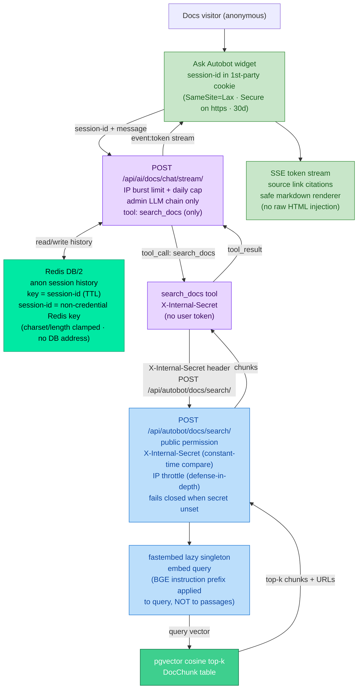

# Autosage-docs Architecture — v3 (Pillar A)

> The public documentation site (`autosage-docs/` repo) plus the RAG pipeline that powers its embedded "Ask Autobot" assistant. This is the first and only unauthenticated surface on the AI backend.

For system-wide context see [architecture.md](./architecture.md). For Autobot service internals see [autobot.architecture.md](./autobot.architecture.md).

---

## Repository split

| Repo | Contents | Deployment |
|---|---|---|
| `autosage/` | Django + Autobot + exec-worker (this repo) | OCI A1 + Cloud Run |
| `autosage-docs/` | Docusaurus static site + Ask Autobot widget | Docs CDN |

The two repos are independent: the docs site calls the Autobot public endpoint via an `AUTOBOT_API_URL` build env var; it has no other runtime dependency on the main repo.

---

## Data model — DocChunk

Owned by Django (`server/autobot_api/` app). One row per chunk from the docs corpus.

| Field | Type | Notes |
|---|---|---|
| `source` | choice | `docs` or `tutorials` |
| `doc_path` | str | relative path in docs repo |
| `title` | str | document title |
| `url` | str | resolved public Docusaurus URL |
| `heading_breadcrumb` | str | heading chain to this chunk |
| `content` | text | chunk text (stripped MDX/JSX) |
| `content_hash` | str | SHA-256 of content — drives idempotent re-ingest |
| `chunk_index` | int | position within document |
| `token_count` | int | approximate token count |
| `embedding` | vector(768) | BAAI/bge-base-en-v1.5 via fastembed |

No per-user field — docs are global and identical for all users.

**pgvector**: the `vector` extension is enabled by a migration that runs before the table migration. Supports cosine distance ORM helpers for top-k retrieval.

---

## Ingestion pipeline (offline)

```mermaid
flowchart LR
    classDef offline fill:#f3e5f5,stroke:#8e24aa,color:#4a148c
    classDef django  fill:#bbdefb,stroke:#1976d2,color:#0d47a1
    classDef supabase fill:#3ecf8e,stroke:#066b3d,color:#fff

    MD["autosage-docs/<br/>{docs,tutorials}/*.md"]:::offline
    Cmd["manage.py ingest_docs<br/>runs inside Django process"]:::django
    Strip["Strip MDX/JSX noise<br/>parse YAML frontmatter"]:::django
    Chunk["Chunk by heading<br/>with size cap"]:::django
    URL["Resolve Docusaurus URL<br/>from routing rules"]:::django
    Embed["fastembed embed passages<br/>BAAI/bge-base-en-v1.5<br/>no instruction prefix on passages"]:::django
    Hash["Compute content hash<br/>idempotent upsert"]:::django
    DB[("Supabase<br/>DocChunk rows")]:::supabase

    MD --> Cmd --> Strip --> Chunk --> URL --> Embed --> Hash --> DB
```

`ingest_docs` must be run once against the live database before search returns results. Re-runs are idempotent by `content_hash` — unchanged chunks are skipped.

**fastembed model is baked into the Django Docker image** (pre-downloaded at build time). First embed call in a fresh container does not block on a download. The model loads lazily on first call — Celery workers, Beat, and scheduler-worker never embed and never pay the RAM cost.

---

## Online request flow

---

## Docusaurus widget design

| Concern | Decision |
|---|---|
| Mount point | Root wrapper ejected — widget mounts once on every route |
| SSR safety | `BrowserOnly` wrapper — renders only in the browser, excluded from static generation |
| Layout on wide screens | Expandable **right sidebar** — shrinks page content gutter, not an overlay |
| Layout on mobile | Full-width overlay below tablet breakpoint (shrinking would make docs unreadable) |
| Open/close trigger | Small floating button; header height matches navbar |
| Answer rendering | Safe markdown renderer — React elements only, no `dangerouslySetInnerHTML` |
| Session identity | First-party cookie `SameSite=Lax`; intentionally **not** HttpOnly (widget JS must read it to send in request body) |
| "Searching..." affordance | Shown during `search_docs` tool round |
| Source citations | Rendered as links from chunk `url` field |
| API URL | Build-time `AUTOBOT_API_URL` custom field (via Docusaurus `customFields`) |
| Disclaimer | Persistent line: assistant is AI and may be wrong |

**Important routing note (dev):** in the local compose stack the browser reaches the AI service through nginx, not directly. The widget's `AUTOBOT_API_URL` must point at the nginx origin (`http://localhost:80`), not at `localhost:8030`.

---

## Deploy order

1. Run `manage.py migrate` — enables pgvector extension, creates `DocChunk` table.
2. Run `manage.py ingest_docs` against the live Supabase database.
3. Deploy Autobot service (new `search_docs` tool + `docs/chat/stream/` endpoint).
4. Deploy Docusaurus site with `AUTOBOT_API_URL` set to the DuckDNS origin.

Autobot must be live before the docs site deploys; Django must be live (with `docs/search/` endpoint) before Autobot deploys.
