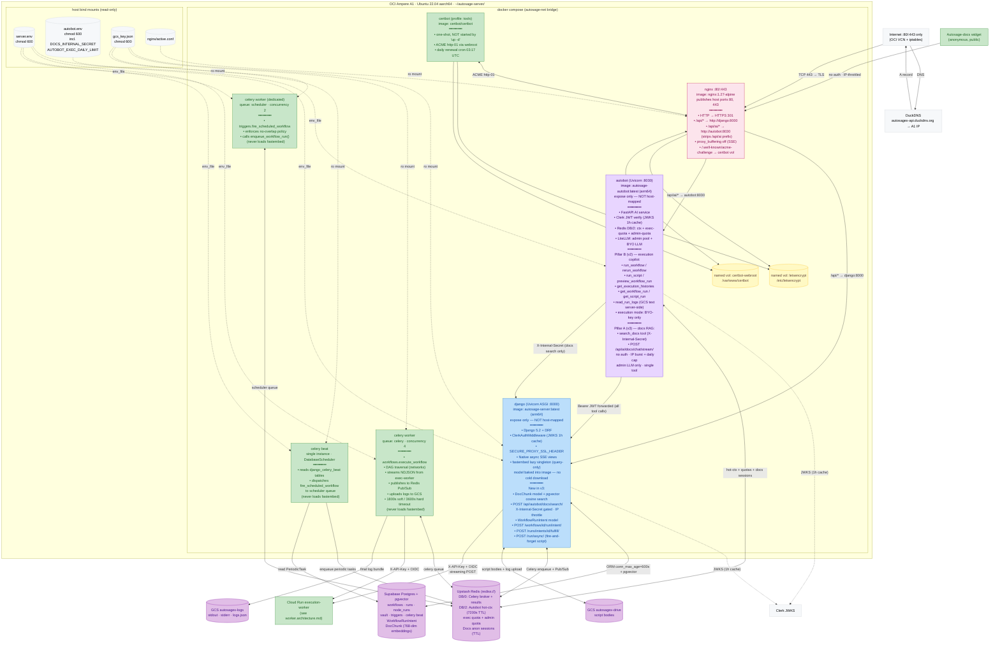
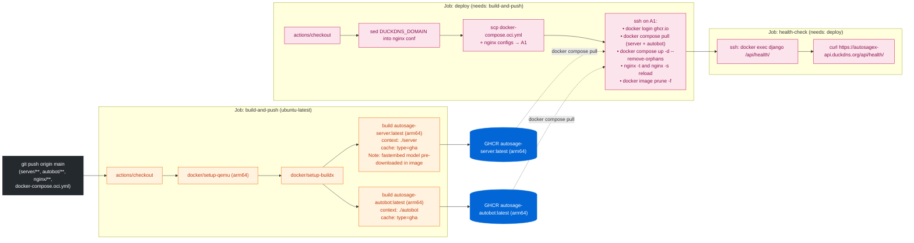
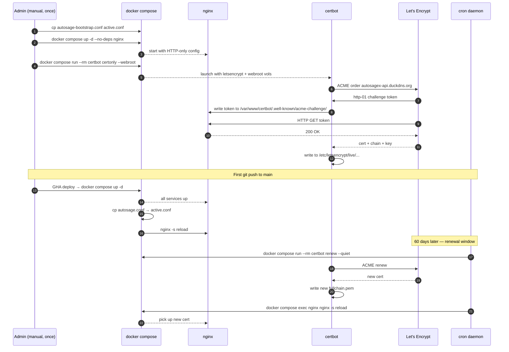
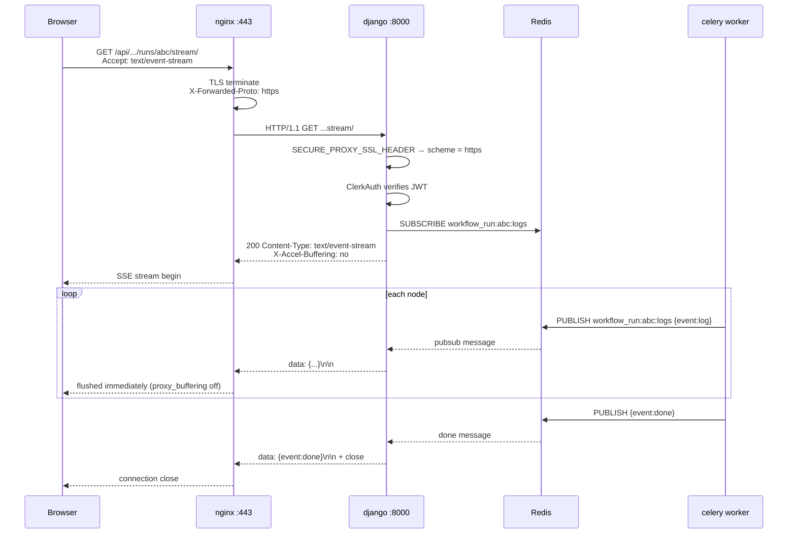

# Autosage Django Server — Deployment Architecture v3

**Host**: OCI Ampere A1 (Ubuntu 22.04 aarch64) · **Public name**: `autosagex-api.duckdns.org` · **Repo path**: `server/**` + `autobot/**` + `nginx/**` + `docker-compose.oci.yml`

> **What changed since v2**: Two new capability pillars, all on the same OCI host — no new VMs or cloud services.
>
> **Pillar A (Docs RAG)**: `DocChunk` model + pgvector extension in Supabase; `fastembed` (BAAI/bge-base-en-v1.5, 768-dim) baked into the Django image as a lazy singleton; `POST /api/autobot/docs/search/` gated by `X-Internal-Secret`; Autobot gains `search_docs` tool + `POST /api/ai/docs/chat/stream/` (public, no auth, IP-throttled).
>
> **Pillar B (Execution Copilot)**: `WorkflowRunIntent` model + `POST /api/execution-engine/workflows/<id>/run/intent/` + `POST /api/execution-engine/workflows/runs/intents/<id>/fulfill/`; `POST /api/execution-engine/run/async/` for fire-and-forget script runs; Autobot gains four execution tools and three investigation tools; execution mode is BYO-key only (refused upfront for admin/shared keys).
>
> v2 doc archived at [../v2/server.architecture.md](../v2/server.architecture.md).

---

## Architecture overview



---

## CI/CD pipeline



---

## New Django endpoints (v3)

### Pillar A — Docs RAG

| Endpoint | Auth | Notes |
|---|---|---|
| `POST /api/autobot/docs/search/` | `X-Internal-Secret` header (constant-time compare, fails closed when unset) | Called only by Autobot's `search_docs` tool; IP-throttled as defense-in-depth; embeds query via fastembed, runs pgvector cosine top-k over `DocChunk` |

### Pillar B — Execution Copilot

| Endpoint | Auth | Notes |
|---|---|---|
| `POST /api/execution-engine/workflows/<id>/run/intent/` | Clerk JWT | Creates `WorkflowRunIntent` (no `WorkflowRun` yet); strips password inputs; returns `{run_intent_id, needs_params}`; TTL 5 min, single-use |
| `POST /api/execution-engine/workflows/runs/intents/<id>/fulfill/` | Clerk JWT | Owner-scoped; validates `is_valid()` (not fulfilled, not expired); merges intent inputs + browser params; calls `enqueue_workflow_run(trigger_source="manual")` so Layer-3 password drop does NOT fire; marks intent fulfilled |
| `POST /api/execution-engine/run/async/` | Clerk JWT | Fire-and-forget script run for Autobot path; Celery task drains stream, discards SSE frames; returns `202 {execution_id, status:"pending"}` |

---

## fastembed resource model

The `fastembed` BAAI/bge-base-en-v1.5 model is **baked into the Django image** at build time (pre-downloaded into a cache directory inside the image).

| Concern | Detail |
|---|---|
| RAM | Loaded **lazily** on first embed call; only the Django web worker (query path) and the `ingest_docs` management command ever embed. Celery, Beat, and scheduler workers never embed and pay **zero extra RAM**. |
| Disk | ~hundreds of MB on the image; Docker layers are shared, so it is one copy on the host regardless of how many containers run from it. |
| Cold start | No egress download on first container start — model is already on-disk in the layer. |
| Query asymmetry | BGE instruction prefix is applied to **query** vectors only; passage vectors at ingest time use no prefix. The helper applies this exactly once on the query side. |

---

## TLS bootstrap & renewal



---

## Host directory layout

```
/home/ubuntu/autosage-server/
├── server.env                  # Django + Celery secrets (chmod 600, $$ escaped)
├── autobot.env                 # Autobot secrets (chmod 600)
│                               #   DOCS_INTERNAL_SECRET (must match Django's)
│                               #   AUTOBOT_EXEC_DAILY_LIMIT
│                               #   AUTOBOT_ADMIN_FALLBACKS
├── gcs_key.json                # GCS SA key → /app/creds/service-account.json (chmod 600)
├── docker-compose.oci.yml      # scp'd by deploy workflow
├── certbot.log                 # cron renewal output
└── nginx/
    ├── autosage.conf           # production TLS config (scp'd, DUCKDNS_DOMAIN substituted)
    ├── autosage-bootstrap.conf # HTTP-only bootstrap (scp'd as-is)
    └── active.conf             # whichever conf is live
```

**Docker named volumes:**

| Volume | Mounted by | Purpose |
|---|---|---|
| `letsencrypt` | nginx (ro), certbot (rw) | `/etc/letsencrypt` — live certs + ACME account state |
| `certbot-webroot` | nginx (ro), certbot (rw) | `/var/www/certbot` — http-01 challenge files |

---

## SSE request flow through nginx



The three nginx settings that make SSE work: `proxy_buffering off`, `proxy_read_timeout 3600s`, `proxy_http_version 1.1` + `proxy_set_header Connection ""`.

---

## GitHub Actions secrets

| Secret | Used by | Purpose |
|---|---|---|
| `GHCR_PAT` | build-and-push, deploy | docker login to ghcr.io |
| `VM_HOST` | deploy, health-check | DuckDNS hostname or A1 public IP |
| `VM_USER` | deploy, health-check | `ubuntu` |
| `VM_SSH_KEY` | deploy, health-check | private key (full PEM) |
| `VM_SSH_PORT` | deploy, health-check | `22` |
| `DUCKDNS_DOMAIN` | deploy, health-check | `autosagex-api.duckdns.org` (no scheme) |
