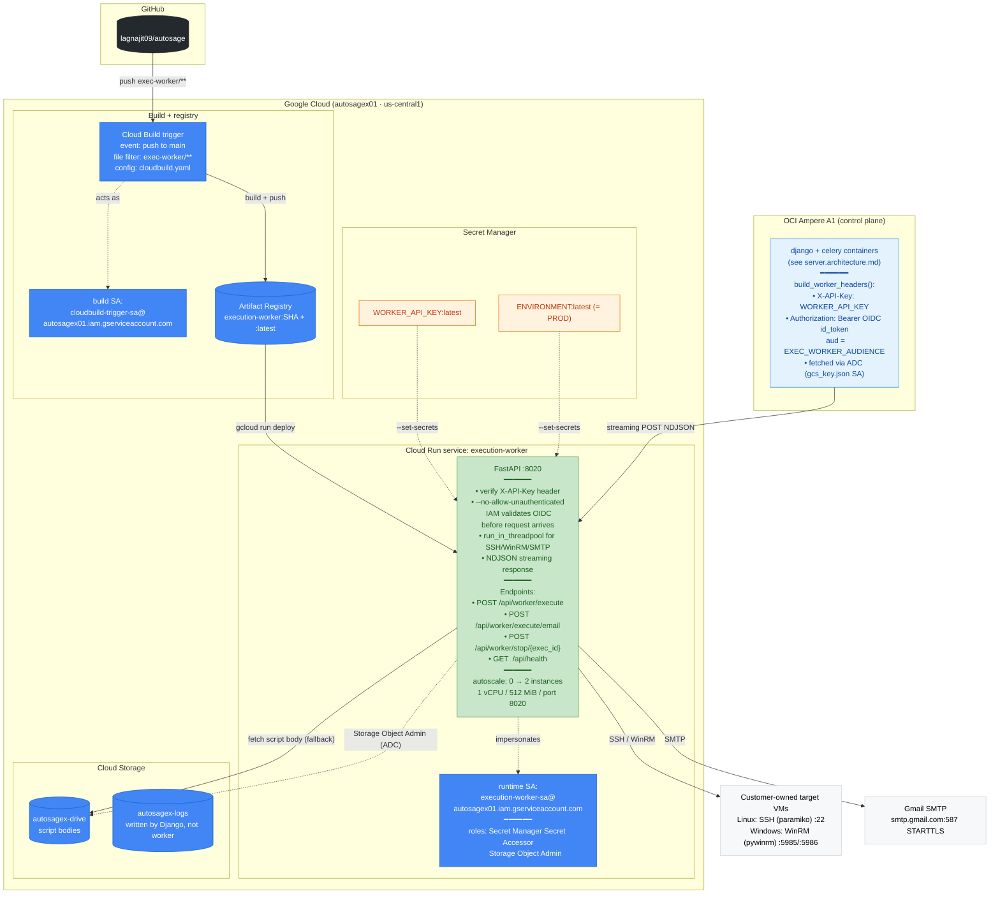
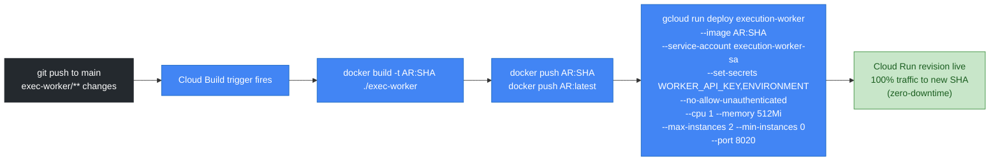
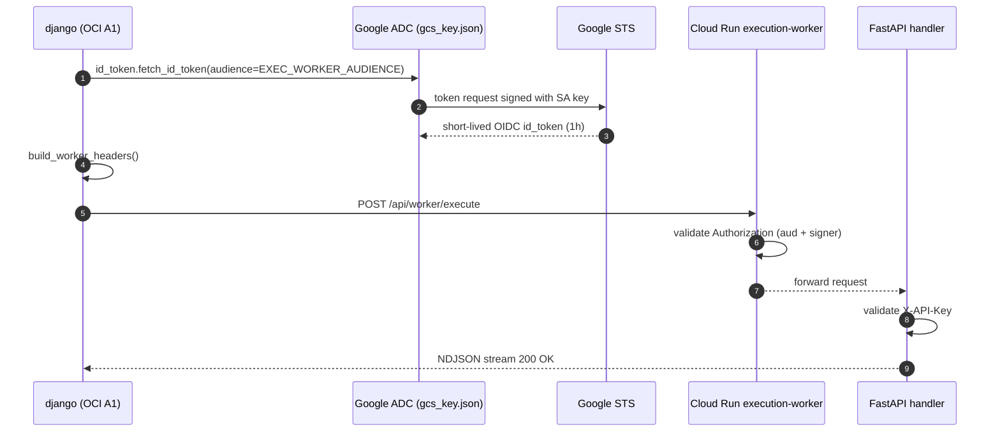

# Autosage Execution Worker — Deployment Architecture v3

**Host**: Cloud Run (autoscale 0→2) · **Region**: `us-central1` · **Repo path**: `exec-worker/**`

> **What changed since v2**: Nothing. The execution plane is intentionally carried forward unchanged. Cloud Run's free tier, scale-to-zero, and OIDC-secured invocation remain the right shape for bursty, short-lived workflow executions. All v3 changes (Docs RAG, Execution Copilot, password side-channel) live in the control plane (Django + Autobot on OCI A1) and do not affect the exec-worker service, its API, its executors, or its CI/CD pipeline.
>
> v2 doc archived at [../v2/worker.architecture.md](../v2/worker.architecture.md).

---

## Architecture overview

---

## Why Cloud Run (not OCI too)

| Property | Cloud Run | OCI Compute |
|---|---|---|
| Scale to zero | Native, billed per request-second | Paid by the minute even when idle |
| Cold-start | ~1–2 s for this Python image | n/a |
| Concurrent slots | 80/instance × 2 instances = 160 | Capped by VM cores |
| Free tier | 180K vCPU-s + 360K GiB-s + 2M req/month | No per-request free pricing |
| IAM-secured invocation | First-class via `--no-allow-unauthenticated` + OIDC | Must roll your own auth gateway |

The control plane (Django + Celery + Beat + Autobot) has persistent state, long-lived SSE connections, and a Redis sidecar — it belongs on a dedicated always-on VM. The execution plane is bursty, stateless, and short-lived — Cloud Run is the right fit.

---

## CI/CD flow (Cloud Build → Cloud Run)

No GitHub Actions involvement for the worker — Cloud Build handles everything in GCP.

---

## Authentication: how Django on OCI calls Cloud Run

The same `gcs_key.json` SA used for GCS access also sources credentials for `fetch_id_token` via `GOOGLE_APPLICATION_CREDENTIALS`. `X-API-Key` is a defense-in-depth check: even if Cloud Run were accidentally made public, a caller would need both the OIDC token and the API key.

---

## Permissions matrix

### Cloud Run runtime SA — `execution-worker-sa@autosagex01.iam.gserviceaccount.com`

| Role | Scope | Why |
|---|---|---|
| `roles/secretmanager.secretAccessor` | `WORKER_API_KEY`, `ENVIRONMENT` | Inject env vars on revision boot |
| `roles/storage.objectAdmin` | `autosagex-drive`, `autosagex-logs` | Script read (fallback) + potential log write |
| `roles/iam.serviceAccountUser` | self | Token impersonation |

### Cloud Build trigger SA — `cloudbuild-trigger-sa@autosagex01.iam.gserviceaccount.com`

| Role | Why |
|---|---|
| `roles/cloudbuild.builds.editor` | Run the build |
| `roles/cloudbuild.builds.builder` | Use Cloud Build worker pool |
| `roles/run.admin` | Update the Cloud Run service |
| `roles/artifactregistry.writer` | Push images |
| `roles/logging.logWriter` | Write build logs |
| `roles/storage.objectAdmin` | Cloud Build temp storage |
| `roles/iam.serviceAccountUser` on `execution-worker-sa` | Allow `gcloud run deploy --service-account=...` |

### Caller (OCI Django) — uses `gcs_key.json` SA

| Role | Why |
|---|---|
| `roles/run.invoker` on `execution-worker` service | Invoke `--no-allow-unauthenticated` Cloud Run |
| `roles/storage.objectAdmin` | scripts + logs buckets |
