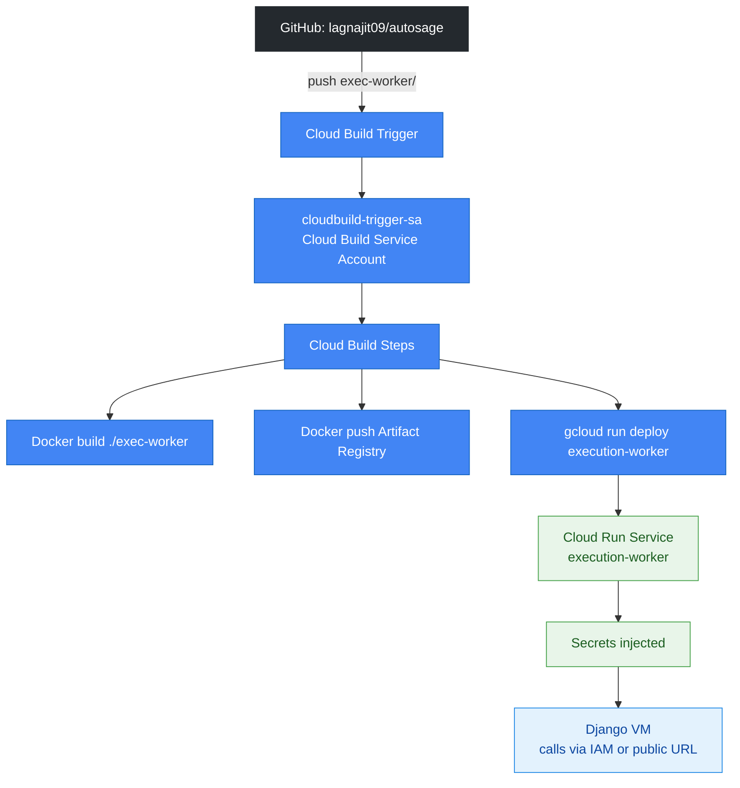

# Autosage Execution Worker — Deployment Guide

**Project**: autosagex01 (us-central1)  
**Repo**: lagnajit09/autosage  
**Trigger path**: `exec-worker/**`

## Complete Deployment Flow

**From local FastAPI code → Production HTTPS endpoint on GCP Always-Free Cloud Run. $0/month.**

## Architecture Overview



## Complete Deployment Flow (From Scratch)

### Phase 1: GCP Prerequisites

1. **Project**: `autosagex01` (us-central1 region)
2. **Enable APIs**:
   - Cloud Run API
   - Cloud Build API
   - Artifact Registry API
   - Secret Manager API
3. **Billing**: Enabled

### Phase 2: Artifact Registry

```
Repository: autosage-exec-worker
Location: us-central1
Format: Docker
Mode: Standard
```

### Phase 3: Service Accounts

#### A. Cloud Run Runtime SA (`execution-worker-sa`)

```
Permissions:
├── Secret Manager Secret Accessor (on WORKER_API_KEY, ENVIRONMENT)
├── Storage Object Admin (on GCS buckets)
└── Service Account User (self-granted for impersonation)
```

#### B. Cloud Build Trigger SA (`cloudbuild-trigger-sa`)

```
Project-level roles:
├── Cloud Build Service Account
├── Cloudbuild Build Editor
├── Cloud Run Admin
├── Artifact Registry Writer
├── Logs Writer
├── Storage Object Admin
└── Service Account User (on execution-worker-sa)
```

### Phase 4: Secrets Manager

```
Secrets created:
├── WORKER_API_KEY (latest version)
└── ENVIRONMENT (latest version)
```

### Phase 5: Repository Structure

```
lagnajit09/autosage/
├── cloudbuild.yml (root)
└── exec-worker/
    ├── Dockerfile
    ├── app.py/main.py
    └── requirements.txt
```

### Phase 6: Cloud Build Trigger Configuration

```
Name: autosage-exec-worker-deploy
Region: us-central1
Source: GitHub Gen2 (lagnajit09/autosage)
Event: Push to branch ^main$
File filter: exec-worker/**
Config: cloudbuild.yml (root)
Service Account: cloudbuild-trigger-sa@autosagex01.iam.gserviceaccount.com
Logs to GitHub: Yes
```

### Phase 7: cloudbuild.yml Workflow

```
1. docker build -t AR_REPO:$COMMIT_SHA exec-worker
2. docker tag ...:latest
3. docker push $COMMIT_SHA
4. docker push latest
5. gcloud run deploy execution-worker:
   ├── --image=AR_REPO:$COMMIT_SHA
   ├── --service-account=execution-worker-sa
   ├── --set-secrets=WORKER_API_KEY=...:latest,ENVIRONMENT=...:latest
   ├── --no-allow-unauthenticated (private)
   ├── --cpu=1 --memory=512Mi
   ├── --max-instances=2 --min-instances=0
   └── --port=8020
```

### Phase 8: Cloud Run Service Configuration

```
Service: execution-worker
Region: us-central1
URL: https://execution-worker-[hash].a.run.app
Status: Serving ✅
Revisions: Auto-managed (latest gets 100% traffic)
Service Account: execution-worker-sa@autosagex01.iam.gserviceaccount.com
Secrets: WORKER_API_KEY ✅, ENVIRONMENT ✅
Autoscaling: 0-2 instances
Port: 8020
Authentication: IAM (private)
```

## CI/CD Trigger Flow

```
Developer → git commit exec-worker/ → git push main
    ↓
Cloud Build Trigger (path filter match)
    ↓
cloudbuild-trigger-sa executes cloudbuild.yml
    ↓
Fresh Docker build → Artifact Registry → Cloud Run revision
    ↓
Django VM calls SAME service URL → gets latest code (zero-downtime)
```

## Access Patterns

```
1. IAM (VM Service Account → roles/run.invoker) ← RECOMMENDED
2. Personal IAM (user:your@email.com → roles/run.invoker)
3. Make public (--allow-unauthenticated)
4. Serverless VPC Connector (private VPC calls)
```

## Cost Structure (Always Free Tier)

```
Cloud Run: us-central1 (free tier eligible)
- 180K vCPU-sec, 360K GiB-sec, 2M requests/month FREE
Artifact Registry: 0.5GB storage FREE
Cloud Build: 120 min/month FREE
Cloud Logging: 50GB/month FREE
```

## Monitoring

```
Cloud Build: History tab + GitHub commit status
Cloud Run: Metrics tab (CPU/Memory/Requests)
Logging: Logs Explorer (cloudbuild.googleapis.com)
Billing: Reports (stay under free tiers)
```

---
