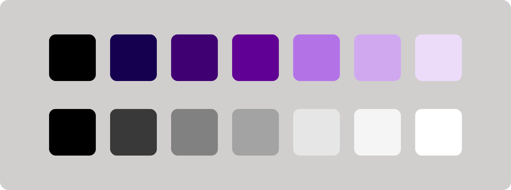

# React-Client App

## Color Palette:

Color Palette: ["000000", "150050", "3F0071", "610094", "ECDCF9", "D0A8F0", "B373E7"]
Gray Palette: ["000000", "39393A", "6E8387", "8FA0A3", "E6E6E6", "F5F5F5", "ffffff"]
